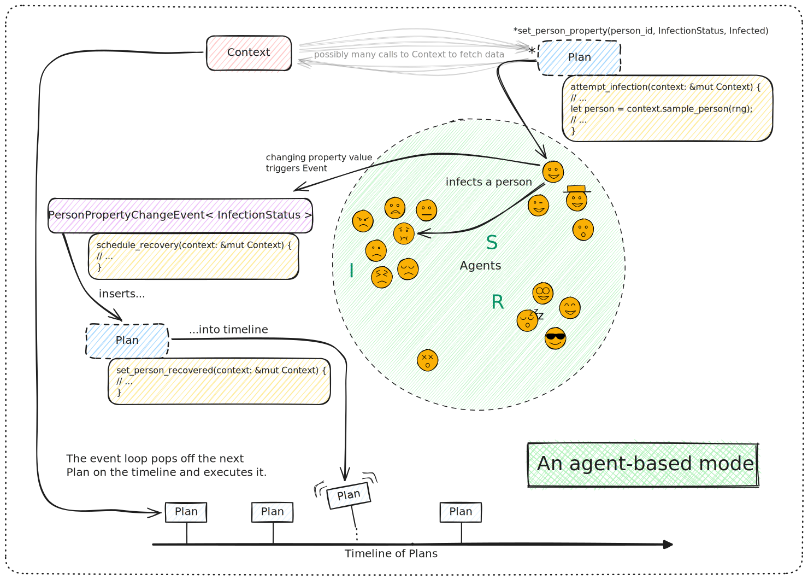

# Your First Model

In this section we will get acquainted with the basic features of Ixa by implementing a simple infectious disease transmission model. This section is just a starting point. It is _not_ intended to be:

- An introduction to the [Rust programming language](https://www.rust-lang.org/learn) (or [crash course](https://stevedonovan.github.io/rust-gentle-intro/readme.html)) or software engineering topics like [source control with Git](https://git-scm.com/book/ms/v2/Getting-Started-About-Version-Control)
- A tutorial on using a Unix-flavored command line
- An overview or survey of either [disease modeling](https://en.wikipedia.org/wiki/Mathematical_modelling_of_infectious_diseases) or [agent-based modeling](https://en.wikipedia.org/wiki/Agent-based_model)
- An exhaustive treatment of all of the features of Ixa

## Our Abstract Model

We introduce modeling in Ixa by implementing a simple model for a food-borne illness where infection events follow a **Poisson process**. We assume that each susceptible person has a constant risk of becoming infected over time, independent of past infections. The Poisson process describes events (infections) occurring randomly in time but with a constant rate.

In this model, each individual susceptible person has an exponentially distributed time until they are infected. This means the time between successive infection events follows an exponential distribution. The rate of infection is typically expressed as a **force of infection**, which is a measure of the risk of a susceptible individual contracting the disease. In the case of a food-borne illness, this force is constant, meaning each susceptible individual faces a fixed probability per unit time of becoming infected, independent of the number of people already infected. Infected individuals subsequently recovery and cannot be re-infected. (Note that while this model has S, I, and R compartments, it is different from the [canonical "SIR" model](https://en.wikipedia.org/wiki/Compartmental_models_(epidemiology)#The_SIR_model). In our simple model, the force of infection does not depend on the prevalence of infected persons. Put another way, our "I" compartment consists merely of _infected_ persons; they are not _infectious_.)

## High-level view of how Ixa functions

This diagram gives a high-level view of how Ixa works:

__

Don't expect to understand everything in this diagram straight away. The major concepts we need to understand about models in Ixa are:

1. **`Context`:** A `Context` keeps track of the state of the world for our model and is the primary way code interacts with anything in the running model.
2. **Timeline:** A future event list of the simulation, the timeline is a queue of `Callback` objects -called _plans_ - that will assume control of the `Context` at a future point in time and execute the logic in the plan.
3. **Plan:** A piece of logic scheduled to execute at a certain time on the timeline. Plans are added to the timeline through the `Context`.
4. **Agents:** Generally people in a disease model, agents are the entities which dynamically interact over the course of the simulation. Data can be associated to agents as properties—"people properties" in our case.
5. **Property:** Data attached to an agent.
6. **Module:** An organizational unit of functionality. Simulations are constructed out of a series of interacting modules that take turns manipulating the Context through a mutable reference. Modules store data in the simulation using the `DataPlugin` trait that allows them to retrieve data by type.
7. **Event:** Modules can also emit 'events' that other modules can subscribe to handle by event type. This allows modules to broadcast that specific things have occurred and have other modules take turns reacting to these occurrences. An example of an event might be a person becoming infected by a disease.

## The organization of a model's implementation

A model in Ixa is a computer program written in the Rust programming language that uses the Ixa library (or "crate" in the language of Rust). A model is organized into of a set of modules that work together to provide all of the functions of the simulation. For instance, a simple disease transmission model might consist of the following modules:

- A population loader that initializes the set of people represented by the simulation.
- A transmission manager that models the process of  how a susceptible person in the population becomes infected.
- An infection manager that transitions infected people through stages of disease until recovery.
- A reporting module that records data about how the disease evolves through the population to a file for later analysis.

The single responsibility principle in software engineering is a key idea behind modularity. It states that each module should have one clear purpose or responsibility. By designing each module to perform a single task (for example, loading the population data, managing the transmission of the disease, or handling infection progression), you create a system where each part is easier to understand, test, and maintain. This not only helps prevent errors but also allows us to iterate and improve each component independently.

In the context of our disease transmission model:

- The **population loader** is solely responsible for setting up the initial state of the simulation by importing and structuring the data about people.
- The **transmission manager** focuses exclusively on modeling the process by which persons get infected.
- The **infection manager** takes care of the progression of the disease within an infected individual until recovery.
- The **reporting module** handles data collection and output, ensuring that results are recorded accurately.

By organizing the model into these distinct modules, each with a single responsibility, we ensure that our simulation remains organized and manageable—even as the complexity of the model grows.

The rest of this chapter develops each of the modules of our model one-by-one.
