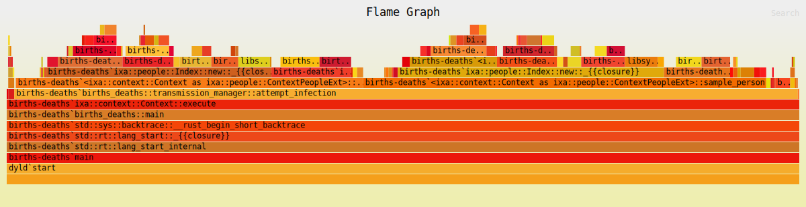

# Performance and Profiling

## Indexing

Indexing properties that are queried repeatedly in your simulation can lead to
dramatic speedups. It is not uncommon to see two or more orders of magnitude of
improvement in some cases. It is also very simple to do.

You can index a single property, or you can index multiple properties _jointly_.
Just include the following method call(s) during the initialization of
`context`, replacing the example property names with your own:

```rust
// For single property indexes
// Somewhere during the initialization of `context`:
context.index_property::<Person, Age>();

// For multi-indexes
// Where properties are defined:
define_multi_property!((Name, Age, Weight), Person);
// Somewhere during the initialization of `context`:
context.index_property::<Person, (Name, Age, Weight)>();
```

The cost of creating indexes is increased memory use, which can be significant
for large populations. So it is best to only create indexes / multi-indexes that
actually improve model performance, especially if cloud computing costs / VM
sizes are an issue.

See the [chapter on Indexing](indexing.md) for full details.

## Optimizing Performance with Build Profiles

Build profiles allow you to configure compiler settings for different kinds of
builds. By default, Cargo uses the `dev` profile, which is usually what you want
for normal development of your model but which does not perform optimization.
When you are ready to run a real experiment with your project, you will want to
use the `release` build profile, which does more aggressive code optimization
and disables runtime checks for numeric overflow and debug assertions. In some
cases, this can improve performance dramatically.

The
[Cargo documentation for build profiles](https://doc.rust-lang.org/cargo/reference/profiles.html)
describes many different settings you can tweak. You are not limited to Cargo's
built in profiles either. In fact, you might wish to create your own profile for
creating flame graphs, for example, as we do in the section on flame graphs
below. These settings go under `\[profile.release]` or a custom profile like
`\[profile.bench]` in your `Cargo.toml` file. For **maximum execution speed**,
the key trio is:

```toml
[profile.release]
opt-level = 3     # Controls the level of optimization. 3 = highest runtime speed. "s"/"z" = size-optimized.
lto = true        # Link Time Optimization. Improves runtime performance by optimizing across crate boundaries.
codegen-units = 1 # Number of codegen units. Lower = better optimization. 1 enables whole-program optimization.
```

The
[Cargo documentation for build profiles](https://doc.rust-lang.org/cargo/reference/profiles.html)
describes a few more settings that can affect runtime performance, but these are
the most important.

## Ixa Profiling Module

For Ixa's built-in profiling (named counts, spans, and JSON output), see the
[Profiling Module](profiling-module.md) topic.

## Visualizing Execution with Flame Graphs

[Samply](https://github.com/mstange/samply/) and
[Flame Graph](https://github.com/flamegraph-rs/flamegraph) are easy to use
profiling tools that generate a "flame graph" that visualizes stack traces,
which allow you to see how much execution time is spent in different parts of
your program. We demonstrate how to use Samply, which has better macOS support.

Install the `samply` tool with Cargo:

```bash
cargo install samply
```

For best results, build your project in both `release` mode and with `debug`
info. The easiest way to do this is to make a build profile, which we name
"profiling" below, by adding the following section to your `Cargo.toml` file:

```toml
[profile.profiling]
inherits = "release"
debug = true
```

Now when we build the project we can specify this build profile to Cargo by
name:

```bash
cargo build --profile profiling
```

This creates your binary in `target/profiling/my_project`, where `my_project` is
standing in for the name of the project. Now run the project with samply:

```bash
samply record ./target/profiling/my_project
```

We can pass command line arguments as usual if we need to:

```bash
samply record ./target/profiling/my_project arg1 arg2
```

When execution completes, samply will open the results in a browser. The graph
looks something like this:



The graph shows the "stack trace," that is, nested function calls, with a
"deeper" function call stacked on top of the function that called it, but does
not otherwise preserve chronological order of execution. Rather, the width of
the function is proportional the time spent within the function over the course
of the entire program execution. Since everything is ultimately called from your
`main` function, you can see `main` at the bottom of the pile stretching the
full width of the graph. This way of representing program execution allows you
to identify "hot spots" where your program is spending most of its time.

## Using Logging to Profile Execution

For simple profiling during development, it is easy to use logging to measure
how long certain operations take. This is especially useful when you want to
understand the cost of specific parts of your application — like loading a large
file.

> [!TIP] Cultivate Good Logging Habits
>
> It's good to cultivate the habit of adding `trace!` and `debug!` logging
> messages to your code. You can always selectively enable or disable messages
> for different parts of your program with per-module log level filters. (See
> [the logging module documentation](https://ixa.rs/doc/ixa/log/index.html) for
> details.)

Suppose we want to know how long it takes to load data for a large population
before we start executing our simulation. We can do this with the following
pattern:

```rust
use std::fs::File;
use std::io::BufReader;
use std::time::Instant;
use ixa::trace;

fn load_population_data(path: &str, context: &mut Context) {
    // Record the start time before we begin loading the data.
    let start = Instant::now();

    let file = File::open(path)?;
    let mut reader = BufReader::new(file);
    // .. code to load in the data goes here ...

    // This line computes the time that has elapsed since `start`.
    let duration = start.elapsed();
    trace!("Loaded population data from {} in {:?}", path, duration);
}
```

## Additional Resources

For an in-depth look at performance in Rust programming, including many advanced
tools and techniques, check out
[The Rust Performance Book](https://nnethercote.github.io/perf-book/title-page.html).
