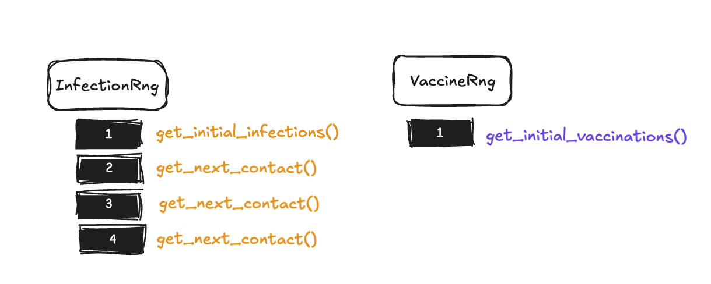
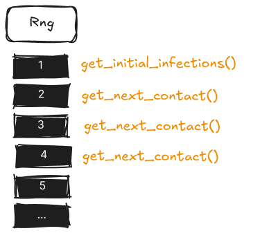

# Random Module

## Challenges of randomness

Random sampling is a fundamental capability for most simulations. The
requirement that experiments also need to be _deterministic_ makes randomness a
subtle issue.

> [!NOTE] Randomness vs. Determinism A _truly random_ number source produces
> numbers in a sequence than cannot be predicted even in principle. A
> _pseudorandom_ number source produces numbers in a sequence according to a
> completely deterministic algorithm, so if you know the algorithm you can
> predict the next number in the sequence exactly. However, good pseudorandom
> number generators can produce sequences that appear indistinguishable from a
> truly random sequence according to a battery of rigorous statistical tests. We
> sometimes use the word random when we actually mean _pseudorandom_. Because we
> want simulations to be reproducible, we want them to be deterministic. But we
> also want statistical randomness within the simulation. Pseudorandom number
> generators give us both determinism and statistical randomness.

Here are the primary ways we handle this challenge in Ixa:

- We use pseudorandom number generators (PRNG or just RNG for short), which when
  provided with a seed number will produce numbers in a statistically random
  sequence—except that using the same seed will produce the same random
  sequence. To run a "new" simulation, provide a different seed.
- The default hash function used in the Rust Standard Library for containers
  like `std::collections::HashMap` and `std::collections::HashSet` is
  nondeterministic for
  [technical reasons](https://en.wikipedia.org/wiki/Collision_attack#Hash_flooding)
  that don't apply to our application. Therefore, we provide `ixa::HashMap` and
  `ixa::HashSet`, which use a deterministic—and much faster—hash function.
- Each module defines its own random number sources, so the use of RNGs in one
  module is somewhat isolated from RNGs used in other modules. Of course, if a
  module interacts with other parts of Ixa, its own random behavior can "leak"
  and affect the determinism of other modules as well.


Using distinct RNGs in distinct components helps maintain simulation
reproducibility and prevents unintended interactions between independent parts
of your model. When modules share RNG streams, adding a new random call in one
component can shift the entire sequence of random numbers consumed by other
components, making it impossible to isolate changes or compare scenarios
reliably. For example, if you're comparing two disease transmission scenarios
where only the infection rate differs, you want the same sequence of people to
be randomly selected for potential infection in both runs - but if these
scenarios share an RNG with a recovery module that makes different numbers of
random calls due to varying infection counts, the transmission module will
consume different parts of the random sequence, compromising the comparison. By
giving each module its own RNG, you ensure that changes in one module's random
behavior don't cascade through the entire simulation, enabling precise scenario
comparisons and reproducible debugging.

> [!NOTE] Requirements for Determinism The determinism guarantee applies to
> repeated execution of the same model compiled with the same version of Ixa.
>
> However, you should not expect identical results between different versions of
> Ixa. When you make changes to your own code, it is very easy to change the
> simulation behavior even if you don't intend to. Do not be surprised if you
> get different results if you make changes to your own code.

## How to make and use a random number source

### 1. Define an RNG with `define_rng!`

Suppose we want to make a transmission manager that randomly samples a person to
become infected. In `transmission_manger.rs` we define a random number source
for our exclusive use in the transmission manager using the `define_rng!` macro,
giving it a unique name:

```rust
define_rng!(TransmissionRng);
```

This macro generates all the code needed to define `TransmissionRng`.

### 2. Ensure the `random` module is initialized

Initialization of the `random` module only needs to be done one time for a given
`Context` instance to initialize all random number sources defined anywhere in
the source. It is not an error to initialize more than once, but the `random`
module's state will be reset on the second initialization.

#### automatically with `run_with_args()`

This step is automatically done for you if you use `run_with_args()`, which is
the recommended way to run your model. This allows you to provide a seed for the
random module as a command line parameter, among other conveniences.

#### manually with `run_with_args()`

Even if you are using `run_with_args()`, you might still wish to
programmatically initialize the `Context` with a hard-coded random seed, say,
during development.

```rust
fn main() {
    run_with_args(|context, _, _| {
        context.init_random(42);
        Ok(())
    })
    .unwrap();
}
```

This re-initializes the random module with the provided seed.

#### manually on `Context`

In cases such as in unit tests, you can initialize the random module manually:

```rust
let mut context = Context::new();
// Initialize with a seed for reproducibility.
context.init_random(42);
```

### 3. Sampling random numbers using the RNG

The `random` module endows `Context` with
[several convenient member functions](https://ixa.rs/doc/ixa/random/trait.ContextRandomExt.html)
you can use to do different kinds of sampling. (The next section covers
several.) The key is to always provide the name of the RNG we defined in step 1.
We called it `TransmissionRng` in our example.

```rust
let random_integer = context.sample_range(TransmissionRng, 0..100);
```

Make sure the `random` module's context extension is imported if your IDE does
not automatically add the import for you:

```rust
use ixa::prelude::*;
```

## Some typical uses of sampling

Ixa provides several methods for generating random values through the context:

### Sample from a Range

```rust
let random_person = context.sample_range(MyRng, 0..POPULATION);
```

### Sample Boolean with Probability

```rust
let result = context.sample_bool(MyRng, 0.4);  // 40% chance of true
```

### Sample from a Distribution

Ixa re-exports the `rand` crate as `ixa::rand`. The `rand` crate comes with
[a few common distributions](https://docs.rs/rand/0.8.5/rand/distributions/index.html).
The [`rand_distr`](https://docs.rs/rand_distr/latest/rand_distr/) and the
[`statrs`](https://docs.rs/statrs/latest/statrs/distribution/index.html) crates
provide many more.

```rust
let value = context.sample_distr(MyRng, Uniform::new(2.0, 10.0).unwrap());
```

> [!WARNING] `rand` Crate Version Compatibility As of this writing, the latest
> version of the `rand` crate is v0.9.1, but some popular crates in the Rust
> ecosystem still use `rand@0.8.*`, which is incompatible. Using an incompatible
> version in your code can result in confusing errors that ends with the
> tell-tale line, "Note: there are multiple different versions of crate `rand`
> in the dependency graph". Always using `rand` that Ixa re-exports at
> `ixa::rand` will help you avoid this trap.

### Custom Random Generation

For more sophisticated sampling use cases, you might need direct access to the
random number generator. In this case, we use a design pattern that ensures we
have safe access to the RNG: we pass a closure to the `context.sample(...)`
method that takes the RNG as an argument. If we didn't already have
`context.sample_weighted(...)`, we could do the following:

```rust
let choices = ['a', 'b', 'c'];
let weights = [2,   1,   1];
let choice = context.sample(MyRng, |rng|{
    let dist = WeightedIndex::new(&weights).unwrap();
    choices[dist.sample(rng)]
});
```
