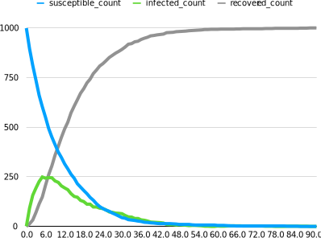

# Reports In Depth

## Syntax Summary and Best Practices

```rust
// Create a struct for a row of the report; must implement `Serialize`.
#[derive(Serialize)]
struct ReportItem {
    // Arbitrary (serializable) data fields.
}

// Define the report item in ixa.
define_report!(ReportItem);

// Somewhere during context initialization, initialize the report:
context.add_report::<ReportItem>("my_report")?;

// To write a row to the report:
context.send_report(
     ReportItem {
         // A concrete ReportItem instance
     }
);
```

Best practices:

- Only record as much data as you require, because gathering and writing data
  takes computation time, the data itself takes up space, and post-processing
  also takes time.
- In particular, avoid a "snapshot the universe" approach to recording
  simulation state.
- Balance the amount of aggregation you do inside your simulation with the
  amount of aggregation you do outside of your simulation. There are trade-offs.
- Do not use the `-f` / `--force-overwrite` flag in production to avoid data
  loss.
- Use indexes / multi-indexes for reports that use queries. (See the chapter on
  [Indexing](indexing.md).)

## Introduction

Ixa reports let you record structured data from your simulation while it runs.
You can capture events, monitor population states over time, and generate
summaries of model behavior. The output is written to CSV files, making it easy
to use external tools or existing data analysis pipelines.

The report API takes care of a lot of details so you don't have to.

- **One file per report type** - Each report you define creates its own CSV file
- **Automatic headers** - Column names are derived from your report structure
- **Hook into global configuration** - Control file names, prefixes, output
  directories, and whether existing output files are overwritten using a
  configuration file or ixa's command line arguments
- **Streaming output** - Data is written incrementally during simulation
  execution

There is also built-in support for reports based on queries and periodic reports
that record data at regular intervals of simulation time.

## Configuring Report Options

You can configure the reporting system using the `report_options()` method on
`Context`. The configuration API uses the builder pattern to configure the
options for all reports for the context at once.

```rust
use ixa::prelude::*;
use std::path::PathBuf;

let mut context = Context::new();
context
    .report_options()
    .file_prefix("simulation_".to_string())
    .directory(PathBuf::from("./output"))
    .overwrite(true);
```

The configuration options are:

| Method                | Description                                                                                                  |
| --------------------- | ------------------------------------------------------------------------------------------------------------ |
| `file_prefix(String)` | A prefix added to all report filenames. Useful for distinguishing different simulation runs or scenarios.    |
| `directory(PathBuf)`  | The directory where CSV files will be written. Defaults to the current working directory.                    |
| `overwrite(bool)`     | Whether to overwrite existing files with the same name. Defaults to `false` to prevent accidental data loss. |

Note that all reports defined in the `Context` share this configuration.

This configuration is also used by other outputs that integrate with report
options, such as the profiling JSON written by
`ixa::profiling::ProfilingContextExt::write_profiling_data()`.

## Case Study 1: A Basic Report

Let's imagine we want a basic report that records every infectiousness status
change event (see `examples/basic-infection/src/incidence_report.rs`). The first
few rows might look like this:

| time                 | person_id | infection_status |
| -------------------- | --------- | ---------------- |
| 0.0                  | 986       | I                |
| 0.001021019741165120 | 373       | I                |
| 0.013085498308028700 | 338       | I                |
| 0.02134601331583040  | 542       | I                |
| 0.02187737003255150  | 879       | I                |
| &vellip;             | &vellip;  | &vellip;         |

As far as ixa's report system is concerned, we really only need four ingredients
for a simple report:

1. A _report item_ type that will represent one row of data in our report,
   basically anything that implements `serde::Serialize`.
2. A `define_report!` macro invocation declaring the report item is for a
   report.
3. A call to `context.add_report()`, which readies the output file for writing.
   This also establishes the filename associated to the report for the report
   item according to your `Context` 's report configuration. (See the section
   "Configuring Report Options" for details.)
4. One or more calls to `context.send_report()`, which write lines of data to
   the output file.

But even for very simple use cases like this one, we will need to "wire up"
simulation events, say, to our data collection. Here is what this might look
like in practice:

```rust
// initialization_report.rs
use ixa::prelude::*;
use serde::{Deserialize, Serialize};
// ...any other imports you may need.

/// 1. This struct will represent a row of data in our report.
#[derive(Serialize)]
struct IncidenceReportItem {
    /// The simulation time (in-universe time) the transition took place
    time: f64,
    /// The ID of the person whose status changed
    person_id: PersonId,
    /// The new status the person transitioned to
    infection_status: InfectionStatusValue,
}

/// 2. Tell ixa that we want a report for `IncidenceReportItem`.
define_report!(IncidenceReportItem);

/// This and other auxiliary types would typically live in a different
/// source file in practice, but we emphasize here how we are "wiring up"
/// the call to `context.send_report()` to the change in a person property.
type InfectionStatusEvent = PersonPropertyChangeEvent<InfectionStatus>;

/// We will want to ensure our initialization function is called before
/// starting the simulation, so let's follow the standard pattern of having
/// an `init()` function for our report module, called from a main
/// initialization function somewhere.
pub fn init(context: &mut Context) -> Result<(), IxaError> {
 /// 3. Prepare the report for use. This gives the report the *short name*
 ///    `"incidence"`.
    context.add_report::<IncidenceReportItem>("incidence")?;
    /// In our example, we will record each transition of infection status
    context.subscribe_to_event::<InfectionStatusEvent>(handle_infection_status_change);
    Ok(())
}

fn handle_infection_status_change(context: &mut Context, event: InfectionStatusEvent) {
 /// 4. Writing a row to the report is as easy as calling
 ///    `context.send_report` with the data you want to record.
    context.send_report(
     IncidenceReportItem {
         time: context.get_current_time(),
         person_id: event.person_id,
         infection_status: event.current,
     }
    );
}
```

This report is event driven: an `InfectionStatusEvent` triggers the creation of
a new row in the report. But do we really want to record _every_ change of
infection status? Suppose what we actually care about is transitions from
susceptible to infected. In that case we might modify the code as follows:

```rust
fn handle_infection_status_change(context: &mut Context, event: InfectionStatusEvent) {
    /// 4. Only write a row if a susceptible person becomes infected.
    if (InfectionStatusValue::Susceptible, InfectionStatusValue::Infected)
        == (event.previous, event.current)
    {
        context.send_report(
            IncidenceReportItem {
                time: context.get_current_time(),
                person_id: event.person_id,
                infection_status: event.current,
            }
        );
    }
}
```

## Report Design Considerations

### Separation of Concerns

Notice that we use a property change event to trigger writing to the report in
the example of the previous section. We could have done it differently: Instead
of subscribing an even handler to a property change event, we could have made
the call to `context.send_report` directly from whatever code changes a person
from "susceptible" to "infected". But this is a bad idea for several reasons:

- **Separation of Concerns & Modularity:** The transmission manager, or whatever
  code is responsible for changing the property value, should not be burdened
  with responsibilities like reporting that are outside of its purview.
  Likewise, the code for the report exists in a single place and has a single
  responsibility.
- **Maintainability:** Putting the call to `context.send_report` with the code
  that makes the property change implicitly assumes that that is the only way
  the property will be changed. But what if we modify how transmission works? We
  would have to remember to also update every single affected call to
  `context.send_report`. This explosion in complexity is exactly the problem the
  event system is meant to solve.

### Data Aggregation

You have to decide what data to include in the report and when to collect it. To
determine the data sets you need, work backwards from what kinds of analysis and
visualizations you will want to produce. It is best to avoid over-printing data
that will not be used downstream of the simulation process. Often the most
important design question is:

> _How much aggregation do you do inside the model versus during post-processing
> after the fact?_

Some of the trade-offs you should consider:

- Aggregation in Rust requires more engineering effort. You generally need to
  work with types and container data structures, which might be unfamiliar to
  programmers coming from dynamic languages like Python.
- Aggregation in Rust generally executes much faster than post-processing in
  Python or R.
- In the model you have access to the full context of the data, including input
  parameters and person properties—all system state—at the time you are
  recording the data. Consequently:
  - you can do more sophisticated filtering of data;
  - you can do computation or processing using the full context that might be
    difficult or impossible after the fact.
- Data processing in Python is easy to do and possibly a pre-existing skillset
  for the model author.
- Relying on post-processing might require very large datasets, possibly many
  gigabytes, which requires both disk space and processing time.

## Case Study 2: A Report With Aggregation

In the Ixa source repository you will find the `basic-infection` example in the
`examples/` directory. You can build and run this example with the following
command:

```bash
cargo run --example basic-infection
```

The incidence report implemented in
`examples/basic-infection/src/incidence-report.rs` is essentially the report of
the section _Case Study 1: A Basic Report_ above, which records the current
time, `PersonId`, and infection status every time there is a change in a
person's `InfectionStatus` property. This obviously results in 2 &times; 1000 =
2000 rows of data, twice the population size, since each person makes two
transitions in this model.

But suppose what we really want is to plot the count of people having each
`InfectionStatusValue` _at the end of each day_ over time.



We can easily compute this data from the existing incidence report in a
post-processing step. But a more efficient approach is to do the aggregation
within the model so that we write only exactly the data we need.

| time     | susceptible_count | infected_count | recovered_count |
| -------- | ----------------- | -------------- | --------------- |
| 0.0      | 999               | 1              | 0               |
| 1.0      | 895               | 92             | 13              |
| 2.0      | 811               | 157            | 32              |
| 3.0      | 737               | 193            | 70              |
| 4.0      | 661               | 226            | 113             |
| &vellip; | &vellip;          | &vellip;       | &vellip;        |

The `MAX_TIME` is set to 300 for this model, so this will result in only 301
rows of data (counting "day 0").

### Aggregation

We could count how many people are in each category every time we write a row to
the report, but it is much faster and more efficient to just keep track of the
counts. We use a data plugin for this purpose:

```rust
struct AggregateSIRDataContainer {
    susceptible_count: usize,
    infected_count: usize,
    recovered_count: usize,
}

define_data_plugin!(AggregateSIRData, AggregateSIRDataContainer,
    AggregateSIRDataContainer {
        susceptible_count: 0,
        infected_count: 0,
        recovered_count: 0,
    }
);
```

We need to initialize the `susceptible_count` in an `init` function:

```rust
pub fn init(context: &mut Context) {
    // Initialize `susceptible_count` with population size.
    let susceptible = context.get_current_population();
    let container = context.get_data_mut(AggregateSIRData);
    container.susceptible_count = susceptible;
   // ...
}
```

And we need to update these counts whenever a person transitions from one
category to another:

```rust
fn handle_infection_status_change(context: &mut Context, event: InfectionStatusEvent) {
    match (event.previous, event.current) {
        (InfectionStatusValue::S, InfectionStatusValue::I) => {
            // A person moved from susceptible to infected.
            let container = context.get_data_mut(AggregateSIRData);
            container.susceptible_count -= 1;
            container.infected_count += 1;
        }
        (InfectionStatusValue::I, InfectionStatusValue::R) => {
            // A person moved from infected to recovered.
            let container = context.get_data_mut(AggregateSIRData);
            container.infected_count -= 1;
            container.recovered_count += 1;
        }
        (_, _) => {
            // No other transitions are possible.
            unreachable!("Unexpected infection status change.");
        }
    }
}
```

We need to wire up this event handler to the `InfectionStatusEvent` in the
`init` function:

```rust
pub fn init(context: &mut Context) {
    // Initialize `susceptible_count` with population size....

    // Wire up the `InfectionStatusEvent` to the handler.
    context.subscribe_to_event::<InfectionStatusEvent>(handle_infection_status_change);
    // ...
}
```

That is everything needed for the bookkeeping.

> [!INFO] Aggregation Inside The Model
>
> The aggregation step often doesn't look like aggregation inside the model,
> because we can accumulate values _as events occur_ instead of aggregating
> values after the fact.

### Reporting

Now we tackle the reporting. We need a struct to represent a row of data:

```rust
// The report item, one row of data.
#[derive(Serialize)]
struct AggregateSIRReportItem {
    time: f64,
    susceptible_count: usize,
    infected_count: usize,
    recovered_count: usize,
}
// Tell ixa it is a report item.
define_report!(AggregateSIRReportItem);
```

Now we initialize the report with the context, and we add a periodic plan to
write to the report at the end of every day. The complete `init()` function is:

```rust
pub fn init(context: &mut Context) {
    // Initialize `susceptible_count` with population size.
    let susceptible = context.get_current_population();
    let container = context.get_data_mut(AggregateSIRData);
    container.susceptible_count = susceptible;

    // Wire up the `InfectionStatusEvent` to the handler.
    context.subscribe_to_event::<InfectionStatusEvent>(handle_infection_status_change);

    // Initialize the report.
    context.add_report::<AggregateSIRReportItem>("aggregate_sir_report")
        .expect("Failed to add report");

    // Write data to the report every simulated day.
    context.add_periodic_plan_with_phase(
        1.0, // A period of 1 day
        write_aggregate_sir_report_item,
        ExecutionPhase::Last // Execute the plan at the end of the simulated day.
    );
}
```

The implementation of `write_aggregate_sir_report_item` is straightforward: We
fetch the values from the data plugin, construct an instance of
`AggregateSIRReportItem`, and "send" it to the report.

```rust
fn write_aggregate_sir_report_item(context: &mut Context) {
    let time = context.get_current_time();
    let container = context.get_data_mut(AggregateSIRData);

    let report_item = AggregateSIRReportItem {
        time,
        susceptible_count: container.susceptible_count,
        infected_count: container.infected_count,
        recovered_count: container.recovered_count,
    };
    context.send_report(report_item);
}
```

Exercise:

1. The `aggregate_sir_report` is 301 lines long, one row every day until
   `MAX_TIME=300`, but most of the rows are of the form `#, 0, 0, 1000`, because
   the entire population is recovered long before we reach `MAX_TIME`. This is
   pretty typical of periodic reports—you get a lot of data you don't need at
   the end of the simulation. Add a simple filter to
   `write_aggregate_sir_report_item` so that the `aggregate_sir_report` only
   contains the data we actually want, about ~90 rows (the first ~90 days).
   Don't just filter on the day, because the "last" day can change with a
   different random seed or changes to the model.
