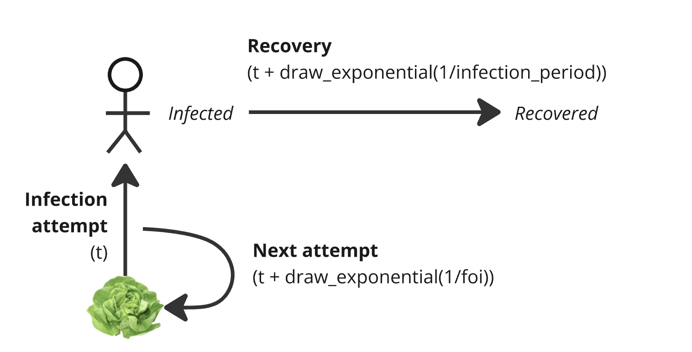
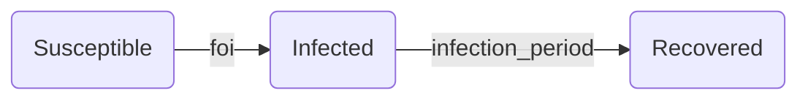

# Infection model: constant force of infection
This example demonstrates a simple model which infects a homogeneous population
assuming a constant force of infection. In other words, all individuals have the same
characteristics, and infections are caused by something like a food-borne disease
 and not from interactions between individuals.

Run the model with `cargo run --example basic-infection`, which will produce a
report in `examples/basic-infection/incidence.csv`.

## Simulation overview




The first infection attempt is scheduled at time 0. Infection attempts are
scheduled to occur based on the constant force of infection. Once an infection
event is scheduled, a susceptible individual is selected to be infected. After
an infection attempt is finished, the next infection event is scheduled based
on a constant force of infection. The simulation ends after no more infection
events are scheduled.

Infected individuals schedule their recovery at time `t + infection_period`.
The infection status of recovered individuals remains as recovered for the
rest of the simulation.

## Parameters

* `SEED`: A seed used to ensure deterministic execution of the model's random number generators.
* `MAX_TIME`: The time at which the model terminates
* `FOI`: force of infection, rate at which susceptible individuals become infected
* `INFECTION_DURATION`: time that an individual spends from infection to recovery
* `POPULATION`: number of individuals to include in the simulation

## Architecture
As in other `ixa` models, the simulation's is managed by a central `Context` object
created in `main.rs`, which loads parameters, initializes user-defined modules,
and starts a callback execution loop.

Individuals transition through a typical SIR pattern where they
start off as susceptible (S), are randomly selected to become infected
(I), and eventually recover (R).



The transition is unidirectional; once recovered, individuals cannot become
susceptible again. The simulation ends when no more infection attempts or
recoveries are scheduled.

The basic structure of the model is as follows:

* A `population_loader` module  that initializes a population and attaches an infection
  status property to each individual
* A `transmission_manager` module that attempts infections, updates the infections status when successful, and schedules the next attempt
* An `infection_manager` module that listens for infections and schedules recoveries
* An `incidence_report` module that listens for infections and recoveries and writes output to csv files.

### People and person properties
When the `population_loader` module initializes, a number of
people are created and given a unique person id (from `0` to `POPULATION`).
This functionality is provided by an `add_person` method from `ixa`'s `people`
module.

In order to record the infection status of a person, we use another `ixa` utility
to define an `InfectionStatusType` "person property". Internally, this associates
each person in the simulation with an enum representing their status as Susceptible,
Infected, or Recovered:

```rust
pub enum InfectionStatus {
    S,
    I,
    R,
}
define_person_property_with_default!(
    InfectionStatusType,
    InfectionStatus,
    InfectionStatus::S
);
```

When created, each person is assigned a default state (`InfectionStatus::S`).

### Scheduling infections and recoveries

In this model, the `transmission_manager` module begins the simulation by adding an
infection attempt `plan`, which is just a callback scheduled to execute at
`current_time = 0`. The callback randomly selects a person and transitions
them to infected if they are susceptible; if they are not susceptible,
it will skip over them. Finally, a new infection attempt is scheduled for
 a time drawn from an exponential distribution with mean value of
 `1/foi`.

Updating the `InfectionStatusType` of a person broadcasts a `PersonPropertyChangeEvent`
through the system. In this model, when the infection status is updated to `Infected`,
a handler registered by the `infection_manager` module will be triggered,
which is responsible for scheduling recovery plans.

Recovery of an infected individuals are scheduled for a time `t + infection_period`
where `infection_period` comes from an exponential distribution.
A `rng` instance provides one independent from the one in the `transmission_manager`.

### Reports

This model includes two types of reports focused on tracking the state of the
infection status:

1. Instantaneous report on changes in person properties, and
2. The current state of person properties reported periodically.

#### Instantaneous Reports
For this report, we want to record a timestamp when a person is infected
and when they recover. The output of the report will look something like this:

```
person_id,infection_status,t
0,Infected,0
1,Infected,1.2
0,Recovered,7.2
1,Infected,8.5
...
```
At initialization, an `incidence_report` module registers a type for `Incidence`
and subscribes change events on the `infection_status` of a person. Note that
`PersonId`s are serialized to their internal identifier.

```rust
struct IncidenceReportItem {
    person_id: PersonId,
    infection_status: InfectionStatus,
    t: u64
}

context.add_report::<IncidenceReportItem>("incidence");
context.subscribe_to_event::<PersonPropertyChangeEvent<InfectionStatusType>>(|context, event| {
        handle_infection_status_change(context, event);
});
```

The method `handle_infection_status_change` writes a new line to the report file
using `context.send_report`.

#### Periodic Reports
The second type of report records something about the current state of the
simulation at the end of a period, such as after every day.

For this example, we record a count of the number of individuals with each
infection status (S,I,R) at the end of every day:

```
day,infection_status,count
0,Suceptible,92
0,Infected,8
0,Recovered,0
1,Suceptible,89,
1,Infected,12
1,Recovered,0
...
```

In this case, we could actually compute each daily summary in
post-processing from the instantaneous reports instead of generating a second
set of periodic reports. However, we want a summary of properties
which are not otherwise recorded, such as perhaps whether an individual is
hospitalized.

To efficiently keep track of the current state of each infection status,
we will create an additional data structure to keep a count of individuals in
each state and is updated every time a change event is released.

```rust
// Internally, HashMap<InfectionStatus, usize>
let counter = PersonPropertyCounter<InfectionStatus>::new();
context.add_data_container(counter);
```

On initialization, the Report manager computes an initial count for each status.
In `update_property_counter` the event handler, the counter increments/decrements
the appropriate status. It also registers a hook that execute after all plans
for a time t have executed, i.e., `on_period_end`

```rust
fn init(context){
    // Calculate the initial state
    population = parameters::get_parameter(population);
    for i in 0..population {
        counter::increment(
            counter.get_person_property_value(i)
        );
    }
    context::observe_person_property_event(update_property_counter);
    context::on_period_end(0, report_periodic_item);
}
```
Methods are implemented for the person property counter to increment and decrement
the counters. Changes in the person properties are
observed and the callback function `update_property_counter` updates the
counts for each property:

```rust
fn handle_infection_status_change(context, person_id, prev, current) {
    counter::increment(current);
    counter::decrement(prev);
}
```

When all plans have executed for a given time t, `ixa` calls the on_period_end
callback to write the report row and schedule the next periodic report:

```rust
fn report_periodic_item(t, context) {
    // Add a row for each status
    for infection_status in counter::iter() {
        context.add_report(Period(
            t,
            infection_status,
            count: counter::get_count(infection_status)
        ));
    }

    // Schedule next report
    next_report_time = context::get_time() + parameters::get_parameter(reporting_period);
    if next_report_time < parameters::get_parameter(max_time) {
        context::on_period_end(report_periodic_item, report_periodic_item);
    }
}
```
