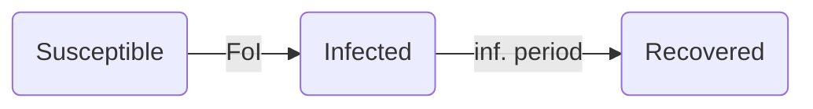

# Infection model: constant force of infection
The purpose of this example is to model the infection process in a homogeneous population assuming a constant force of infection, such as from the environment.

## Entities, states and variables

- individuals: represent people in a population who can have three states representing their infection status: susceptible, infected, or recovered.
  - susceptible: individuals with this status can be infected
  - infected: represents active infection. In this model, infected individuals are not able to transmit to others. After a recovery period, infected individuals update their status to recovered.
  - recovered: represents recovery from infection. Individuals with this state are not able to get infected.
- variables:
  - population size: number of individuals to include in the simulation
  - force of infection: rate at which susceptible individuals become infected
  - infection period: time that an individual spends from infection to recovery

## Simulation overview
The first infection attempt is scheduled at time 0. Infection events are scheduled to occur based on the constant force of infection. Once an infection event is scheduled, a susceptible individual is selected to be infected.  After infection attempt is finished, the next infection event is scheduled based on the constant force of infection. The simulation ends after no more infection events are scheduled.

Infected individuals schedule their recovery at time `t + infected period`. The infection status of recovered individuals remains as recovered for the rest of the simulation.


## Main simulation
The simulation is set and run by a main simulation routine. The main routine loads the required modules and executes the simulation. The first module to be loaded is the parameters modul. Then, the population manager creates a population of individuals with unique person ids and a person property determining their infection status, which is initially set as Susceptible. After the population is created, the transmission manager module is loaded. In the transmission manager, new infections occur at a rate determined by a constant force of infection, which doesn't require interactions among individuals (e.g., food-borne disease). The transmission manager is initialized by creating a new random generator number for transmission events and scheduling an infection attempt on day 0. Each infection attempt selects a random person in the population. This random person is only infected if its current infection status is Susceptible. After an infection attempt is made, a new infection attempt is scheduled for a time drawn from an exponential distribution with mean value of `1/infection_rate`. Finally, in the main simulation routine, the infection manager module is loaded. This module is initialized by subscribing to events related to changes in person properties, particularly when a person's infection status is set to Infected (handled by `handle_infection_status_change`). The purpose of the function `handle_infection_status_change` is to schedule the recovery of an infected individual for a time `t + infection_period` where `infection_period` comes from an exponential distribution. The simulation ends when there aren't more events or plans scheduled in the context.

- Main
```
load context
context.add_module(parameters); // includes force of infection, population size, and infection period.
context.add_module(population_manager); // it requires parameters module to read population size
context.add_module(transmission_manager);
context.add_module(infection_manager);
context.add_module(person_property_report);

//do all the steps necessary to set up the report item handler
setup_report!(context, person_property_report, "incidence_report.csv");

context.execute();

```

- parameters module
```
parameters = struct(
    population_size = 1000,
    foi = 0.04,
    infection_period = 5)

init(context) {
    context.create_data_container(parameters)
}
```

- Population module: The population module depends on the person module, the parameters module, and the infection properties module. Within the population manager, a number of persons are created and given a unique person id (from 0 to `population_size`). At person creation, an infection status is defined as a property for each individual with an initial value of Susceptible, indicating that everyone in the simulation could be infected at the beginning of the simulation. The context stores the person properties as a data structure for each individual as well as an set containing the population defined by a `person_id`.

```
// Crate a new infection_status and add it as a property
infection_status = enum(Susceptible, Infected, Recovered);
init(context) {
    context.define_person_property(infection_status, default = Susceptible);

    for (person_id in 0..parameters.get_parameter(population_size)) {
        context.create_person(person_id = person_id)
    }
}
```

- Transmission manager module:
```
dependencies: context, parameters, random number generator, person infection status, person, population manager;

//methods

fn attempt_infection(context) {
    transmission_rng = rng.get_rng(id = transmission);
    population = context.get_population();
    person_to_infect = transmission_rng.sample_int(from = 0, to = population);

    if (context.get_infection_status(person_to_infect) == Susceptible) {
        context.set_infection_status(person_to_infect, Infected);
    }

    foi = parameters.get_parameter(foi);
    time_next_infection = transmission_rng.draw_exponential(1/foi);
    context.add_plan(attempt_infection(context), time = context.get_time() + time_next_infection);
}

//initialization
init(context) {
    context.add_rng(id = transmission);
    context.add_plan(attempt_infection(context), time = 0);
}

```
- Infection manager module: At initialization, this module adds a new random number generator and subscribes to events generated by changes in infection status. This module handles infection events by scheduling recovery for infected individuals.

```
dependencies: random number generator, person infection status, person, context, parameters;

//methods
fn handle_infection_status_change(context, person_id, old_infection_status) {
    if (context.get_infection_status(person_id) == Infected) {
        infection_rng = context.get_rng(id = infection);
        infection_period = parameters.get_parameter(infection_period)
        recovery_time = infection_rng.draw_exponential(1/infection_period);
    context.add_plan(context.set_infection_status(person_id, Recovered), time = recovery_time);
    }
}

//initialization
init(context) {
    context.add_rng(id = infection);

    // This function in context should send, time, person_id, and infection status change.
    context.observe_infection_status_event(handle_infection_status_change);
}
```
- Infection status transitions



## Reports
This model includes two types of report focused on tracking the state of the infection status defined as a person property: 1) instantaneous report on changes in person properties, and 2) current state of person properties reported periodically.

### Report for changes in person properties
This report requires a data structure to store instantaneous changes in person properties that will be printed to a file.
```
//data
report_data = struct(t:u64, person_property_type:Type(InfectionStatus), person_property_value:InfectionStatus, person_id:u64);
```

At initialization, the report module reads the file name from the parameters module and creates a new file.  Finally, the report module subscribes to observe changes in person properties, which passes a callback function `handle_person_property_change` that requires `context, person_id, old_infection_status`.
```
init(context) {
    context.observe_infection_status_event(handle_person_property_change(context, person_id, old_infection_status));
}
```

The method `handle_person_property_change` writes a new line to the report file with the change in the person property of infection status.
```
fn handle_person_property_change(context, person_id, infection_status){
    report_data = (t = context.get_time(), person_property_type = Type(infection_status), person_property_value = context.get_infection_status(person_id), person_id = person_id);
    context.print_report_data(report_data, report_file); // Method to print to csv, tsv to be implemented in the context.
}
```

### Periodic report

## Modules description
 - *parameters module*: this module manages data for parameter values for population size, force of infection, and infection period. At initialization, all parameter variables are set to a specific value.
 - *person module*: contains a unique ID for each person that identifies each person in the simulation.
 - *`person_infection_status` module*: this module connects each person ID with a specific value for a person's infection status, which could be one of Susceptible, Infected, or Recovered.
 - *population manager module*: The population manager module is in charge of setting up the population. At initialization, the module reads the population size (N) parameter and creates N persons with unique ids (1..N) and sets their initial infection status to Susceptible.
 - *transmission module*: This module is in charge of spreading the infection through the population. At initialization, it schedules an infection attempt for time 0. An infection attempt consists of choosing at random a susceptible individual from the population and setting their infection status to **infected**. Each infection attempt, also schedules the next infection attempt, which time is based on the force of infection.
 - *infection manager module*: This module controls the infection status of each person. Transmission of pathogen is not handled in this module, only individual's infection status. Specifically, it handles the progression of newly infected persons by scheduling recovery, which is drawn from an exponential distribution based on the infection period parameter from the parameters module.
 - *reports module*: This module reports changes in infection status.
 - *random_number_generator module*: Two random number generators are required. One to control the sequence of susceptible persons drawn in the transmission module, and another to control the specific times of recovery in the infection manager module.

## Events and observation
- Changes in the infection status of individuals release an event that are observed by the simulation context.
- Only events changing from susceptible to infected are handled by scheduling a change in infection status to recovered based on the infected period.

## Stochasticity
Stochasticity in the simulation affects
 - the timing of infections,
 - the order of individuals  infected, and
 - times to recovery from infected individuals.
