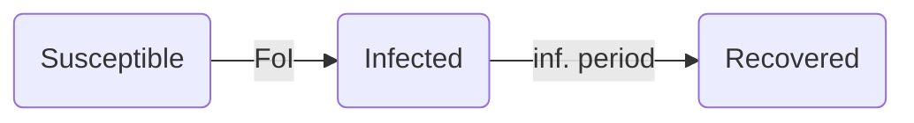
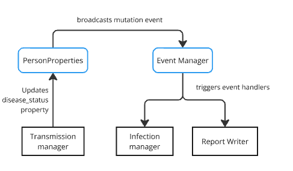

# Infection model: constant force of infection
This example demonstrates a simple model which infects a homogeneous population
assuming a constant force of infection. In other words, all individuals have the same
characteristics, and infections are caused by something like a food-borne disease
 and not from interactions between individuals.

## Simulation overview
The first infection attempt is scheduled at time 0. Infection attempts are scheduled to occur based on the constant force of infection. Once an infection event is scheduled, a susceptible individual is selected to be infected. After an infection attempt is finished, the next infection event is scheduled based on the constant force of infection. The simulation ends after no more infection events are scheduled.

Infected individuals schedule their recovery at time `t + infected period`. The infection status of recovered individuals remains as recovered for the rest of the simulation.

The global model parameters are as follows:
* `population_size`: number of individuals to include in the simulation
* `foi`: force of infection, rate at which susceptible individuals become infected
* `infection_period`: time that an individual spends from infection to recovery

## Architecture
As in other `ixa` models, the simulation is managed by a central `Context` object
which loads parameters, initializes user-defined modules, and starts a callback
execution loop:

```
struct Parameters {
    random_seed: u64,
    population_size: usize,
    foi: f64,
    infection_period: u64
}

let context = Context::new();
context.load_parameters<Parameters>("config.toml")

// Initialize modules
context.add_module(population_manager);
context.add_module(transmission_manager);
context.add_module(infection_manager);
context.add_module(person_property_report);

// Run the simulation
context.execute();
```

Individuals transition through a typical SIR pattern they where
start off as susceptible (S), are randomly selected to become infected
(I), and eventually recover (R).



The transition is unidirectional; once recovered, individuals cannot become
suceptible again. The simulation ends when no more infection attempts or
recoveries are scheduled.

The basic structure of the model is as follows:

* A `Population Loader`, which initializes a population and attaches an infection
  status property to each individual
* A `Transmission Manager`, which attempts infections, updates the infections status when successful, and schedules the next attempt
* An `Infection Manager`, which listens for infections and schedules recoveries.
* A `Report Writer` module, which listens for infections and recoveries and writes output to csv
 files.

 Note that this will require some kind of parameter loading utility
from `ixa` which reads from a config file / command line arguments,
and exposes values to modules as global properties.

### People and person properties
When the `Population Loader` module initializes, a number of
persons are created and given a unique person id (from `0` to `population_size`).
This functionality is provided by an `add_person` method from `ixa`, which adds
them to a `People` data container.

In order to record the infection status of a person, we use another `ixa` utility
for defining "person properties". Internally, this associates each person in
the `People` data container with an enum value and and provides an API for modules
to read it, change it, or subscribe to events
when the property is changed somewhere else in the system.

```
infection_status = enum(
    Susceptible,
    Infected,
    Recovered
);

for (person_id in 0..parameters.get_parameter(population_size)) {
    context.create_person(person_id = person_id)
}

context.define_person_property(
    infection_status,
    default = Susceptible
);
```

When initialized, each person is assigned an default state (`Susceptible`).

Once the population has been created, all modules have been initialized, and event listeners have been registered (more on this below), the simulation is ready
to begin the execution loop.

### Scheduling infections and recoveries
In this model, the `Transmission Manager` module begins the simulation by adding a
infection attempt `plan`, which is just a callback scheduled to execute at
`current_time = 0`. The callback randomly selects a person and transitions
them to infected if they are susceptible; if they are not susceptible,
it will skip over them. Finally, a new infection attempt is scheduled for
 a time drawn from an exponential distribution with mean value of
 `1/infection_rate`.

```
fn attempt_infection(context) {
    transmission_rng = rng.get_rng(id = transmission);
    population = context.get_population();
    person_to_infect = transmission_rng.sample_int(from = 0, to = population);

    if (context.get_infection_status(person_to_infect) == Susceptible) {
        context.set_infection_status(person_to_infect, Infected);
    }

    foi = parameters.get_parameter(foi);
    time_next_infection = transmission_rng.draw_exponential(1/foi);
    context.add_plan(attempt_infection(context), time = context.get_time() + time_next_infection);
}

//initialization
init(context) {
    context.add_rng(id = transmission);
    context.add_plan(attempt_infection(context), time = 0);
}
```

Note that this makes use of the following `ixa` functionality:

* The getters/setters provided by `person_properties`, as described in the previous
  section
* An `add_plan` method to register infection attempt callbacks
* A `random` module to sample the population and generate the next infection time

Updating the `infection_status` of a person should broadcast a mutation
event through the system, which might be structured something like the following:



For any person property that is registered, `ixa` stores a list of callbacks
registered by other modules. When a mutation is made to that person property,
the event manager releases an event with relevant related data
(the id of the person, the old and/or new property) to all matching registered
callbacks.

In this model, when the `disease_status` is updated to `Infected`, a handler
registered by the `Infection Manager` will be triggered, which is responsible
for scheduling recovery plans:

```
fn handler(context, person_id, previous_infection_status) {
    if (context.get_infection_status(person_id) == Infected) {
        infection_rng = context.get_rng(id = infection);
        infection_period = parameters.get_parameter(infection_period)
        recovery_time = infection_rng.draw_exponential(1/infection_period);
    context.add_plan(context.set_infection_status(person_id, Recovered), time = recovery_time);
    }
}

//initialization
init(context) {
    context.add_rng(id = infection);
    context.observe_person_property_event::<DiseaseStatus>(handler);
}
```

Recovery of an infected individuals are scheduled for a time `t + infection_period`
where `infection_period` comes from an exponential distribution. This is provided
by an `rng` instance independent from the one in the `Transmission Manager`.

### Reports

This model includes two types of reports focused on tracking the state of the
infection status:

1. Instantaneous report on changes in person properties, and
2. The current state of person properties reported periodically.

#### Instantaneous Reports
This report requires a data structure to store instantaneous changes in person properties that will be printed to a file. For this model, only changes to
Infected or Recovered are reported.

```
//data
report_data = struct(t:u64, person_property_type:Type(InfectionStatus), person_property_value:InfectionStatus, person_id:u64);
```

At initialization, the report module reads the file name from the parameters module and creates a new file.  Finally, the report module subscribes to observe changes in person properties, which passes a callback function `handle_person_property_change` that requires `context, person_id, previous_infection_status`.
```
init(context) {
    context.observe_person_property_event(handle_person_property_change(context, person_id, previous_infection_status));
}
```

The method `handle_person_property_change` writes a new line to the report file with the change in the person property of infection status.
```
fn handle_person_property_change(context, person_id, infection_status){
    report_data = (t = context.get_time(), person_property_type = Type(infection_status), person_property_value = context.get_infection_status(person_id), person_id = person_id);
    context.print_report_data(report_data); // Method to print to csv, tsv to be implemented in the
}
```

#### Periodic Reports
To report the current state of each Infection Status (Susceptible, Infected, or Recovered), this report needs an additional data structure that keeps a count of individuals on each state and is updated every time an event is released due to changes in infection status.
```
person_property_counter = struct {
    map: hashmap<PropertyType, hashmap<property_value, int>>;
    // e.g., this map could represent 100 susceptible people
    // <InfectionStatus, <Susceptible, 100>>
}
context.add_data_container(person_property_counter)
```
At initialization, the property counter is initialized with the current state of all the population. The report also observes changes in person properties which are handled by a function that updates counts in the property counter. The first report day is scheduled for t = 0.
```
init(context){
    population = parameters.get_parameter(population);
    for i in 0..population {
        for person_property in context.get_person_property_types().to_list() {
            for person_property_value in (person_property.to_list()) {
                person_property_counter.increment(person_property,person_property_value);
            }
        }
    }
    context.observe_person_property_event(update_property_counter);
    context.add_plan(report_periodic_item, time = 0);
}
```
Methods are implemented for person property counter to increment and decrement the counters. For the periodic report, one method will release the periodic items to a report based on the period defined in parameters. Changes in the person properties are observed and the callback function `update_property_counter` updates the counts for each property.
```
fn update_property_counter(context, person_id,
                           person_property_type,
                           previous_person_property_value) {
    person_property_counter.increment(context.get_person_property(person_property_type, person_id));
    person_property_counter.decrement(person_property_type, previous_person_property_value);
}

fn report_periodic_item(context) {
    // Report all items in the counter
    for person_property in context.get_person_property_types().to_list() {
            for person_property_value in (person_property.to_list()) {
                report_item = {
                t = context.get_time(),
                person_property_type = person_property,
                person_property_value = person_property_value,
                person_property_counter = person_property_counter.get_counter(person_property, person_property_value),
                }
                context.print_report_data(report_item);
            }
        }
    }

    // Schedule next report day
    next_report_time = context.get_time() + paramters.get_parameter(reporting_period);
    if next_report_time < parameters.get_parameter(max_days) {
        context.add_plan(report_periodic_item, next_report_time);
    }
}
```

## Ixa dependencies

The following are a summary of assumed dependencies from `ixa`:

* `parameters` component: Loads parameters from a file or command line args,
   loads them into global properties (below)
* `global_properties` component: Defines properties which can be accessible
   to any module
* `person` component: Creates a `People` data container which unique ID for each person,
   provides an `add_person()` method
* `person_properties` component: connects each person ID defined by the `person`
   component with a specific property (e.g., `infection_status`), provides add/change/subscribe API
* `reports` component: Handles file writing, provides api for writing typed rows
* `random_number_generator` component: Provides seedable rng api to sample over
   a distribution, list of person ids
* `event_manager` component: provides a global send/subscribe interface
