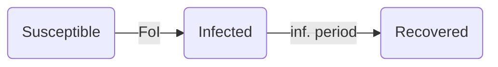

# Infection model: constant force of infection
The purpose of this example is to model the infection process in a homogeneous population assuming a constant force of infection, such as from the environment.

## Entities, states and variables

- individuals: represent people in a population who can have three states representing their infection status: susceptible, infected, or recovered.
  - susceptible: individuals with this status can be infected
  - infected: represents active infection. In this model, infected individuals are not able to transmit to others. After a recovery period, infected individuals update their status to recovered.
  - recovered: represents recovery from infection. Individuals with this state are not able to get infected.
- variables:
  - population size: number of individuals to include in the simulation
  - force of infection: rate at which susceptible individuals become infected
  - infected period: time that an individual spends from infection to recovery

## Initialization
All individuals in the population are created with an infection property which is initialized as susceptible.

## Simulation overview
The first infection attempt is scheduled at time 0. Infection events are scheduled to occur based on the constant force of infection. Once an infection event is scheduled, a susceptible individual is selected to be infected.  After infection attempt is finished, the next infection event is scheduled based on the constant force of infection. The simulation ends after no more infection events are scheduled.

Infected individuals schedule their recovery at time `t + infected period`. The infection status of recovered individuals remains as recovered for the rest of the simulation.

### Infection state transitions

### Events and observation
- Changes in the infection status of individuals release an event that are observed by the simulation context.
- Only events changing from susceptible to infected are handled by scheduling a change in infection status to recovered based on the infected period.

## Stochasticity
Stochasticity in the simulation affects
 - the timing of infections,
 - the order of individuals  infected, and
 - times to recovery from infected individuals.
