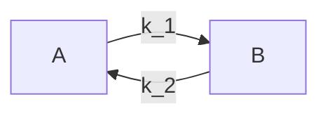
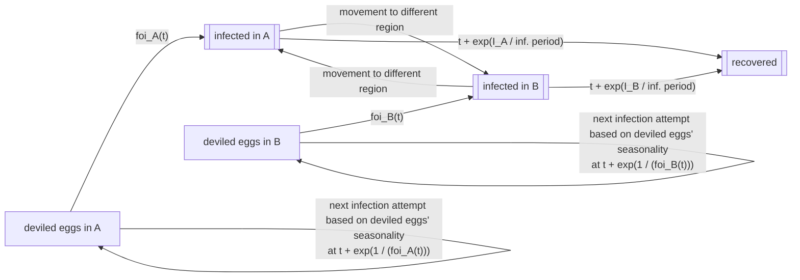

# Infection model: group-dependent time-varying force of infectiousness and recovery

This example demonstrates infections in a stratified population where the force of infection varies by person "group". This is meant to model people that are split by some defining characteristic -- let us conceptualize that as regions A and B -- that impacts their risk of infection. In line with the , there is no person-to-person transmission (food-borne illness). However, in addition to varying by region, the force of infection also varies by season, as if in region A (say, North America), people are more likely to eat deviled eggs from December to January (winter) whereas in region B (South America), they are more likely to eat deviled eggs from June to July (their winter).

People may move between regions, which impacts their experienced force of infection. Although moving regions does not impact an individual's infection status immediately, to make this example of regions really need to function like a group and not just a fancy person property, I introduce that an individual's _recovery_ rate scales inversely with the number of infected people in the region at the time of infection, as if having more sick people in a region means that an individual cannot as easily obtain the care they require/must wait longer to be cured of their deviled egg syndrome.

This model differs from the last example in three key ways:
1) The people are divided among regions, and the force of infection varies by region.
2) The force of infection changes over time based on seasonality.
3) People may move to a different region throughout the simulation, which impacts their risk of sickness and the duration of recovery, not just for themselves but for all individuals in the region.

This example introduces the idea of a `group` that enables assigning people to broader categories. I argue that regions are a type of group, a special case that must satisfy some additional constraints beyond the the generic `group`. This detailing of `groups` and how regions is a special case is described extensively in .

One goal of this example is to bench test `ixa`'s capabilities and help motivate functionalities that must be developed outside the core ABM components to run more complex models, like data loading or efficiently dealing with time-varying infectiousness. In essence: how can we continue to iterate on `ixa`'s structure so that data reading, model analysis/interpretation, and modularity are also improved? I hope for this example to (a) show users of how to set up more advanced models and (b) be iterated on as we continue to develop `ixa` to drive maximal ergonomicity/modularity.

## Simulation overview

This simulation consists of three key pieces of logic:
1) Scheduling infection attempts based on a region-specific and time-varying force of infection.
2) Scheduling people to move between regions at specified rates.
3) Scheduling and updating individual person recovery/progress through the infection course based on the number of sick people in the region.

Each of these pieces of logic is different from the last example -- in fact, #1 and #2 are completely new -- and introduce some new required `ixa` functionality. In particular, a region-specific force of infection requires needing to (a) assign people to regions (enforcing that people are part of one and only one region) and (b) querying a person's region to determine their specific force of infection. The additional complexity of recovery rates depending on the number of people who are infected in the particular region requires (c) getting all people in person's region.

Secondly, implementing time-varying infectiousness in a continuous time simulator is not trivial. This example explains how to do so both via inverse transform sampling (i.e., analytically) and rejection sampling, emphasizing when one can be used over the other. Modeling time-varying infectiousness does not require any new functionality from `ixa`.

Finally, this model introduces movement between groups; this does not actually require any "new" functionality from `ixa` (besides what has been described above in terms of needing to assign people to groups). This is just code that schedules people to have their region changed (or re-assigned) at times based off the specified movement rates.

The simulation ends after there are no more infection events. However, there will be still schedules of people moving between regions ongoing continuously.

Movement between regions is scheduled at a given rate, starting at time 0, so that people can move across regions. The movement rate between regions does not need to be congruent -- so movement from `A` to `B` does not necessarily equal movement from `B` to `A`. (People may want to go from `A` to `B` more readily than people go from `B` to `A`). At each movement time, a random person -- regardless of their infection status -- is selected to move. Their infection status does not change, though their recovery time is impacted by their region's number of infected people.



The global model parameters are as follows:
* `population_size`: number of individuals in the simulation (in this example, we assume that each region has on average the same number of people to start)
* `k`: number of population groups/regions (derived from the )
* `foi_sin_shift`: for ease in this example, imagine that the force of infection is $sin(foi_sin_shift + t) + 1$; this parameter specifies that phase shift for each region and is a hashmap of (region, foi_sin_shift) pairs. Because this is an _agent_-based model, this is the _per-person_ foi.
* `base_infection_period`: base time that an individual spends from infection to recovery, gets scaled by number of infecteds in region.
* `movement`: pair-wise movement rates, square matrix of length `k` coded as a hashmap with the key being the region and the value being a second hashmap that again has regions as the key and movement rates as the value (`ixa` should -- in its parameter loading component -- provide functionality for taking a dataframe and turning it into a nested hashmap like this). Because this is an _agent_-based model, this is the _per-person_ movement rate.

Individuals transition through a typical SIR pattern where they start off as susceptible (S), become randomly infected (I), and eventually recover (R). However, this example is different from the preceding where individuals become infected at a _time-varying_ force of infectiousness that depends on their region $r$, $foi_r(t)$. Then, individuals recover at a rate that scales inversely with the number of infected people in the region, $\gamma \propto 1 / I_r$.



## Architecture

The basic structure of the model is as follows:

* A `Population Loader`, which places `population_size` people into the simulation.
* A `Transmission Manager`, which schedules the time for the next infectious attempt based on the region-specific time-varying force of infection. Queries the person's region to determine the force of infection. Because the force of infection is not constant, it is slightly more complicated to schedule infectious attempts that are consistent with this changing force of infection. In this particular example, we employ inverse transform sampling as a way to determine infection time with time-varying infectiousness.
* An `Infection Manager`, which watches for infections and schedules recoveries accordingly (based on the number of infected people in the region). Does so using rejection sampling because the rate of recovery is not known.
* A `Region Manager`, which assigns people to regions (so there are `population_size/k` people in each region; panics if $population_size < k$), moves people between regions based on specified rates, and modifies the individual's recovery rate based on the number of infectious individuals in their region.
* A `Report Writer` module, which listens for infections and recoveries and writes output to csv files, containing region-stratified disease patterns.

Note that reading the input data will require some kind of parameter loading utility from `ixa` which reads from a config file, and exposes values to modules as global properties. This component must be mature enough to handle data that would be stored as a matrix or vector and put it into meaningful Rust data structures.

As in other `ixa` models, the simulation is managed by a central `Context` object which loads parameters, initializes user-defined modules, and starts a callback execution loop:

```rust
struct Parameters {
    random_seed: u64,
    population_size: usize,
    foi: HashMap<Counties, f64>,
    base_infection_period: f64,
    movement: HashMap<HashMap<Counties, f64>>
}

let context = Context::new();
context::load_parameters<Parameters>("config.toml")

// Initialize modules
mod people
mod transmission
mod infection
mod regions

people.init();
transmission.init();
infection.init();
regions.init();

// Run the simulation
context.execute();
```

### People and person properties

People must be added to the simulation and have some properties assigned to them, such as their infection status. Their infection time is relevant for scheduling their recovery (more on this below). In this example, I tether assigning people to groups to moving them between regions, and do the assignment there. However, this is open to discussion.

In `people.rs`:

```rust
enum Properties {infection_status, infection_time}
// infection_time is Option<f64> with default value None
enum InfectionStatus {S, I, R}

fn init(context: &mut Context) {

    // create the population and make them all susceptible -- ignoring their region for now
    for id in 0..population_size {
        let Person person = context.add_person();
        person.set_property_value(Properties::infection_status, InfectionStatus::S);
    }
}
```

### Movement between regions

In `regions.rs`:

```rust
use strum_macros::EnumIter;
use ixa::GroupMappings::*;

enum GroupTypes {Counties}

#[derive(Debug, EnumIter)]
enum Counties {A, B}

define_rng!(MovementRng);
define_group!(GroupType::Counties,
              Counties,
              GroupMappings::one_to_one);

fn init(context: &mut Context) {
    // assign people to regions and plan their movement upon their creation
    // this may not be the structure we ultimately decide upon for assigning
    // information to people upon their creation
    context.subscribe_to_event(PersonCreationEvent, assign_and_plan_movement);
}

// note there is an alternate implementation where the per-region movement rate is calculated,
// and then a random person is selected within the region to move.
fn assign_and_plan_movement(context: &mut Context,
                            person_creation_event: PersonCreationEvent) {
    // evenly distribute ppl among the counties
    // get number of counties
    let mut k;
    for county in Counties::iter() {
        k += 1;
    }
    let county_index = parameters.get_parameter(population_size) % k;
    let mut county: Counties;
    let county_iter = Counties::iter();
    // because county_index = 0 means the first option in enum Counties
    county = county_iter.next();
    for i in 0..county_index {
        county = county_iter.next();
    }
    // initial assignment of person to county
    context.assign_person_to_group(person_creation_event.person_id(), county);
    // schedule person movement
    move_person(&person_creation_event.person_id());
}

fn move_person(person_id: &PersonID) {
    // pick a region that the person will ultimately land up in
    // but ensure there is flux to that region
    movement_rates_all = parameters.get_parameter(movement);
    let mut movement_rate = 0;
    let movement_rates = movement_rates_all.get(context.get_person_group(GroupType::Counties,
                                                                         person_id));
    let mut end_county: County;
    while movement_rate == 0 {
        // randomly pick an end county index
        let end_county_index = context.sample_range(MovementRng, 0..k);
        // get the associated county
        let county_iter = Counties::iter();
        end_county = county_iter.next();
        for i in 0..end_county_index {
            end_county = county_iter.next();
        }
        // get the movement rate
        let movement_rate = movement_rates.get(end_county);
    }
    context.add_plan(move |context|
                     // i conceptualize ixa as knowing that Counties is one-to-one, so
                     // this "assignment" is actually a "remove" person from last group
                     // and then assign them to this new group
                     // in other words, always staying in line with the group mapping requirements
                     {context.assign_person_to_group(person_id, end_county);
                      move_person(person_id);},
                      context.get_time() + context.sample_distr(MovementRng,
                                                                Exp::new(movement_rate).unwrap()));
}
```

### Scheduling infection based on time-varying foi

In `transmission.rs`:

```rust
use roots::find_root_brent;
use reikna::integral::*;
define_rng!(InfectionRng);

let infection_plans: HashMap<PersonID, Id> = HashMap::new()

fn init(context: &mut Context) {
    context.subscribe_to_event(PersonCreationEvent, expose_person_to_deviled_eggs);
    context.subscribe_to_event(PersonGroupUpdateEvent<Counties>, reexpose_person_to_deviled_eggs);
}

fn expose_person_to_deviled_eggs(context: &mut Context,
                                 person_creation_event: PersonCreationEvent) {
    inverse_sampling_infection(context, person_creation_event.person_id());
}

fn reexpose_person_to_deviled_eggs(context: &mut Context,
                                   person_group_update_event: PersonGroupUpdateEvent<Counties>) {
    inverse_sampling_infection(context, person_group_update_event.person_id());
}

// parameterize the foi
fn foi(t: f64, sin_shift: f64) -> f64 {
    f64::sin(t + sin_shift) + 1
}

// Evaluate whether infection can happen analytically -- because we know foi(t) exactly
// here's how the method works: foi(t) describes the hazard rate for infection at a
// given time, so 1 - e ^ -\int_0^t foi(u)du is the cumulative probability of infection at t.
// Therefore, infection has happened by time t with the probability described above.
// Drawing a random number on U(0, 1) gives a probability for the infection happening when the
// CDF hits that value. To find the time at which this occurs, solve for the value of t
// that gives that value of the CDF.
// The math behind this is the same as drawing s ~ Exp(1), setting that equal to \int_0^t foi(u)du,
// and solving for the time t at which the infection happens, which is fewer steps/easier.
fn inverse_sampling_infection(context: &mut Context, person_id: PersonID) {
    // only sample to infect if person is still susceptible
    if matches!(context.get_person_property(person_id, Properties::infection_status),
                InfectionStatus::S) {
        // random exponential value
        let s = context.sample_distr(InfectionRng, Exp1::new());
        // get the time by following the formula described above
        // first need to get the person's region to get their sin_shift
        let person_county = context.get_person_group(GroupType::counties, person_id);
        let sin_shift = parameters.get_parameter(foi_sin_shift).get(person_county);
        let f = func!(move |t| foi(t, sin_shift));
        // as easy as Python to integrate and find roots in Rust!
        let f_int_shifted = func!(move |t| integrate(&f, 0, t) - s);
        let t = find_root_brent(0f64, 100f64, // guesses for the root bracketing
                                f_int_shifted).unwrap();
        // need to keep track of infections in case this person shifts regions,
        // we would need to cancel this plan and schedule another infection plan
        // because they would be subject to a different force of infection
        let potential_id: Option<Id> = infection_plans.insert(person_id,
                            context.add_plan(context.set_person_property(person_id,
                                                                            Properties::infection_status,
                                                                            InfectionStatus::I)),
                            t);
        // cancel the plan if already in place because this person has a new region,
        // so new foi experienced
        match potential_id {
            Some(id) => context.cancel_plan(id),
            None => {},
        }
        context.add_plan(context.set_person_property(person_id, Properties::infection_time, context.get_time()),
                        t)
    }
}

```

### Scheduling recoveries based on number of infected people in region

In `infection.rs`:

```rust
const MAXIMUM_FOI: f64 = 2.0;
fn init(context: &mut Context) {
    context.subscribe_to_event(PersonPropertyUpdateEvent<InfectionStatus>, evaluate_recovery);
}

// Here we really do have to use rejection sampling because we have no analytical
// expression for the infection recovery time a priori.
// Instead, we sample at a rate faster than the rate of change in the probability of
// no longer being infected
fn evaluate_recovery(context: &mut Context,
                     person_property_update_event: PersonPropertyUpdateEvent<InfectionStatus>) {
    rejection_sample_recovery(context, person_property_update_event.person_id());
}

fn rejection_sample_recovery(context: &mut Context, person_id: PersonID) {
    // get the number of infected people in the region
    let county: County = context.get_person_group(GroupType::Counties,
                                                  person_property_upate_event.person_id());
    // this feels very partition-esque...
    let mut n_infec = context.get_people_in_group(county).iter()
                             .filter(|&person_id| matches!(InfectionStatus::I,
                                                           context.get_person_property(Properties::InfectionStatus,
                                                            &person_id))).count();
    // evaluate whether recovery should have already happened based on rejection sampling
    let movement_rates_all = parameters.get_parameter(movement);
    if context.sample_bool(p_recovery(n_infec)) {
        context.set_person_property(person_id, Properties::infection_status, InfectionStatus::R);
    } else { // resample
    // resample at maximum absolute rate of change in n_infec
    // min(influx of n_infec from other regions, foi(t), 1 / base_infection_period)
    let person_county = context.get_person_group(GroupType::Counties, person_id);
    let infected_rate = movement_rates_all.get(person_county);
    //append to the vector
    infected_rate.push(1 / parameters.get_parameter(base_infection_period));
    infected_rate.push(MAXIMUM_FOI);
    context.add_plan(rejection_sample_recovery(context, person_id),
                     context.sample_distr(InfectionRng,
                                          Exp::new(infected_rate.iter().min().unwrap()).unwrap()));
    }
}

fn p_recovery(n_infec) -> f64 {
    // CDF of exponential distribution to evaluate whether recovery has already happened
    1.0 - f64::exp(1 / (n_infec * parameters.get_parameter(base_infection_period)))
}
```

## Reports

This model includes two types of reports focused on tracking the state of the infection status, akin to the last example:

1. Instantaneous report on changes in person properties.
2. The current state of person properties reported periodically.

However, in this example, we want to also have the person's region outputted -- and therefore calculate the number of people who are infected by region. While GCM reported people's region because "region" was a special kind of group where outputting that was natural, in this new model where region is just a subclass of group, I believe that `ixa` should have functionality to label certain groups as being relevant for reporting and should output relevant person properties by those groups.

While the "instantaneous" report looks very similar:

```
person_id,counties,infection_status,t
0,A,Infected,0
1,B,Infected,1.2
0,A,Recovered,7.2
1,B,Infected,8.5
...
```

the periodic report has an additional stratifier by which the internal `counter` groups people before incrementing (and lists the number of people in the group?):

```
day,counties,infection_status,count
0,A,Suceptible,47
0,B,Suceptible,45
0,A,Infected,3
0,B,Infected,5
0,A,Recovered,0
0,B,Recovered,1
1,A,Suceptible,42
1,B,Suceptible,39
...
```

## Ixa dependencies

The following are a summary of assumed dependencies from `ixa`:

* `parameters` component: Loads parameters from a file or command line args into global properties, accessible by any module.
* `global_properties` component: Defines properties which can be accessible to any module.
* `person` component: Creates a `People` data container with unique ID for each person, provides an `add_person()` method that enables information about the person -- from other modules -- to be attached to the person.
* `person_properties` component: connects each person ID defined by the `person` component with a specific property (e.g., `infection_status`), provides an API to change properties and subscribe to changes in those properties.
* `groups` component: defines groups, their group properties including membership rules, and an API for assigning people to groups in line with the group membership rules, getting people in the group and the groups for a given person, and subscribing to changes in people's groups.
* `reports` component: Handles file writing, provides API for writing typed rows.
* `random_number_generator` component: Provides seedable rng API to sample over a distribution or list of person ids.
* `event_manager` component: provides a global send/subscribe interface.

This example underscores some key required functionalities/things to think about in `ixa`:
1) Having ways of loading complex data (either from toml files or directly reading CSVs) into Rust data types like vectors, hashmaps, etc. is critical for building more complicated models. We should think about the best way to structure toml input files.
2) Time-varying infectiousness can be implemented straightforwardly: it is up to the user to decide the most efficient sampling method to use. We should think about examples to continue to further illustrate this/make it easy by having a library of curves available to users. Also, because Rust does not allow parameter overloading of functions, you have to write these redundant patterns of a subscribe function has a handle function, but that handle function has to call another function in order to not have to pass around the event when a per-person function is repeatedly applied. This pattern is potentially a bit messy.
3) It's very easy to have "event proliferation" where there are many different types of events. We should think about the user exposure to various types of events and how they could potentially be merged.
