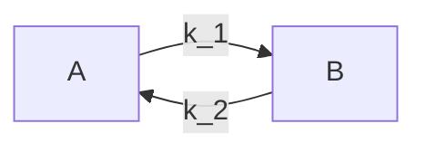

# Infection model: constant force of infection
This example demonstrates infections in a stratified population where the force of infection varies by person "group". This is meant to model people that are split by some defining characteristic -- let us conceptualize that as regions A and B. In line with the , there is no person-to-person transmission. However, in addition to varying by region, the force of infection also varies by season, as if in region A (say, North America), people are more likely to eat deviled eggs from December to January (winter) whereas in region B (South America), they are more likely to eat deviled eggs from June to July (their winter). People may move between regions, which impacts their experienced force of infection. Although moving regions does not impact an individual's infection status immediately, to make this example of regions really need to function like a group and not just a fancy person property, I introduce that an individual's _recovery_ rate scales inversely with the number of infected people currently in the region, as if having more sick people in a region means that an individual cannot obtain the care they require to be cured of their deviled egg syndrome.

This model differs from the last example in three key ways:
1) The people are divided among regions, and the force of infection varies by region.
2) The force of infection changes over time based on seasonality.
3) People may move to a different region throughout the simulation, which impacts their risk of sickness and the duration of recovery posed to other people in that region.

This example introduces the idea of a `group`, which is an abstract concept that enables assigning people to broader categories. I argue that regions are a type of group, a special case that must satisfy some additional constraints than the generic `group`. This detailing of `groups` and how regions is a special case of a group is described more extensively in .

## Simulation overview

This simulation consists of three key pieces of logic:
1) scheduling infection attempts based on a region-specific and time-varying force of infection.
2) scheduling people to move between regions at specified rates.
3) scheduling individual person recovery/progress through the infection course based on the number of sick people in the region.

Each of these pieces of logic is different from the last example -- in fact, logics #1 and #2 are completely new -- and introduce some new required `ixa` functionality. In particular, a region-specific force of infection requires needing to (a) assign people to regions (enforcing that people are part of one and only one region) and (b) querying a person's region to determine their force of infection. The additional complexity of wanting to make recovery rates dependent on the number of people who are infected in the particular region requires (c) returning all people in person's region.

Secondly, implementing time-varying infectiousness in a continuous time simulator is not trivial. This example explains how to do so using rejection sampling, though there does exist another option, and explains the pitfalls of rejection sampling. Modeling time-varying infectiousness does not require any new functionality from `ixa`.

Finally, this model introduces movement between groups, but that does not actually require any "new" functionality from `ixa` (besides what has been described above in terms of needing to assign people to groups). This is just code that schedules people to have their region changed (or re-assigned) at times based off the specified movement rates.

The simulation ends after there are no more infection events. However, there will be still schedules of people moving between regions, events which are ignored when determining when to call `context.halt()`.

Movement between regions is scheduled at a given rate, starting at time 0, so that people can move across regions. The movement rate between regions does not need to be congruent -- so movement from `A` to `B` does not necessarily equal movement from `B` to `A`. (People may want to go from `A` to `B` more readily than people go from `B` to `A`) At each movement time, a random person -- regardless of their infection status -- is selected to move. Their infection status does not change, though their recovery time is impacted by their region's number of infected people.



The global model parameters are as follows:
* `population_size`: number of individuals by group (in this example, we assume that each region has the same number of people to start)
* `k`: number of population groups/regions
* `foi_sin_shift`: for ease in this example, imagine that the force of infection is sin(foi_sin_shift * t) + 1; this parameter specifies that phase shift for each region, so is a vector of length `k`
* `infection_period`: base time that an individual spends from infection to recovery, gets scaled by number of infecteds in region
* `movement`: pair-wise movement rates, square matrix of length `k` coded as a vector of lenfth `k` where each element is a vector of length `k`

## Architecture

The basic structure of the model is as follows:

* A `Population Loader`, which places `population_size` people each into every one of `k` regions and attaches an infection status of susceptible to every individual.
* A `Transmission Manager`, which schedules the time for the next infectious attempt. Because the force of infection is not constant, it is slightly more complicated to schedule infectious attempts that are consistent with this changing force of infection. In this particular example, we employ rejection sampling as a way to sample time-varying infectiousness.
* An `Infection Manager`, which listens for infections and schedules recoveries. This is no different from the previous example.
* A `Movement Manager` which enables people to move across regions based on specified rates.
* A `Report Writer` module, which listens for infections and recoveries and writes output to csv files, containing region-stratified disease patterns.

Note that this will require some kind of parameter loading utility from `ixa` which reads from a config file / command line arguments, and exposes values to modules as global properties.

As in other `ixa` models, the simulation is managed by a central `Context` object which loads parameters, initializes user-defined modules, and starts a callback execution loop:

```rust
struct Parameters {
    random_seed: u64,
    population_size: usize,
    k: usize,
    foi: Vec<f64>,
    infection_period: u64,
    movement: Vec<Vec<f64>>
}

let context = Context::new();
context::load_parameters<Parameters>("config.toml")

// Initialize modules
mod people
mod transmission
mod infection
mod regions

people.init();
transmission.init();
infection.init();
regions.init();

// Run the simulation
context.execute();
```

Individuals transition through a typical SIR pattern where they start off as susceptible (S), are randomly selected to become infected (I), and eventually recover (R). Although there is no person-to-person transmission, the force of infection changes with the number of infected people in the particular region.


### People and person properties
When the `Population Loader` module initializes, a number of persons are created and given a unique person id (from `0` to `population_size`). This functionality is provided by an `add_person` method from `ixa`, which adds them to a `People` data container.

In order to record the infection status of a person, we use another `ixa` utility for defining "person properties". Internally, this associates each person in the `People` data container with an enum value and provides an API for modules to read it, change it, or subscribe to events when the property is changed somewhere else in the system.

To assign people to a region (each person is assigned to one and only one region), we use another `ixa` utility for defining groups, of which region is one particular case where the assignment of person to group is unique, and each person can only be in one group. Internally, this associates each person in the `People` data container with one enum value of the regions available in the model and provides an API for modules to read, change, or subscribe to events when an individual's region is changed somewhere else in the system.

```
use ixa::GroupMappings
regions = enum(A, B);

infection_status = enum(
    Susceptible,
    Infected,
    Recovered
);

context.define_group(regions, GroupMappings::one_to_one);

for (region in regions) {
    for (person_id in 0..parameters.get_parameter(population_size)) {
        person = context.create_person(person_id = person_id);
        // recall that we are viewing regions just as a special case of groups
        // so we want the interface to have capability to assign a person to
        // some but not all group types
        person.assign_to_groups((region));
        person.finalize();
    }
}

context.define_person_property(
    infection_status,
    default = Susceptible
);
```

When initialized, each person is assigned a default infection state (`Susceptible`). Each person is also assigned to a region, so there are `population_size` people in each of the `k` regions. This assignment process

Once the population has been created, all modules have been initialized, and event listeners have been registered (more on this below), the simulation is ready to begin the execution loop.

### Scheduling infections and recoveries
In this model, the `Transmission Manager` module begins the simulation by adding an infection attempt `plan`, which is just an event scheduled to execute at `current_time = 0`. At the time of execution, the plan randomly selects a person and transitions them to infected if they are susceptible; if they are not susceptible, it will skip over them. Because the force of infection changes with time, a new infection attempt cannot just be drawn from an exponential with rate `foi`. In this conceptual example, we use rejection sampling to show how time-varying infectiousness may be modeled: instead, times are drawn from an exponential with rate equal to the _maximum_ value of the force of infection. However, only `foi(t) / max(foi(t))` fraction of plans are allowed to proceed to actual infection attempts.

```
fn attempt_infection(context) {
    foi = context.calculate_foi(context.get_time());
    transmission_rng = rng.get_rng(id = transmission);
    if (context.sample(transmission_rng, RngCore::next_u64) < foi[t] / max(foi[t])) {
        context.get_population();
        person_index_to_infect = transmission_rng.sample_int(from = 0, to = population_size);
        person_region = transmission_rng.sample(regions);

        person_to_infect = context.get_people_in_group(person_region)[person_index_to_infect];

        if (context.get_infection_status(person_to_infect) == infection_status::Susceptible) {
            context.set_infection_status(person_to_infect, infection_status::Infected);
        }
    }
    foi = parameters.get_parameter(foi);
    time_next_infection = transmission_rng.draw_exponential(1/max(foi[t]));
    context.add_plan(attempt_infection(context), time = context.get_time() + time_next_infection);
}

//initialization
init(context) {
    context.add_rng(id = transmission);
    context.add_plan(attempt_infection(context), time = 0);
}
```

Note that this makes use of the following `ixa` functionality:

* The getters/setters provided by `person_properties`, as described in the previous section
* An `add_plan` method to register infection attempt callbacks
* A `random` module to sample the population and generate the next infection time

Updating the `infection_status` of a person should broadcast a mutation event through the system, which might be structured something like the following:

For any person property that is registered, `ixa` stores a list of callbacks registered by other modules. When a mutation is made to that person property, the event manager releases an event with relevant related data (the id of the person, the old and/or new property) to all matching registered callbacks.

In this model, when the `disease_status` is updated to `Infected`, a handler registered by the `Infection Manager` will be triggered, which is responsible for scheduling recovery plans:

```
fn handler(context, person_id, previous_infection_status) {
    if (context.get_infection_status(person_id) == Infected) {
        infection_rng = context.get_rng(id = infection);
        infection_period = parameters.get_parameter(infection_period)
        recovery_time = infection_rng.draw_exponential(1/infection_period);
    context.add_plan(context.set_infection_status(person_id, Recovered), time = recovery_time);
    }
}

//initialization
init(context) {
    context.add_rng(id = infection);
    context.observe_person_property_event::<DiseaseStatus>(handler);
}
```

Recovery of an infected individuals are scheduled for a time `t + infection_period` where `infection_period` comes from an exponential distribution. This is provided by an `rng` instance independent from the one in the `Transmission Manager`.

### Movement between regions

Individuals move between regions at specified rates.

```

fn move_region(context, new_region, rate) {
    context.assign_to_groups((new_region))
    context.add_plan(move_region(context, new_region, rate),
                context.get_time() + movement.sample_distr(Exp(1 / rate)));
}

init(context) {
    context.add_rng(movement);
    for (old_region in regions) {
        for (new_region in regions) {
            if (old_region != new_region) {
                rate = parameters.get_parameter(movement_rate)[old_region][new_region]'
                context.add_plan(move_region(context, new_region, rate),
                    context.get_time() + movement.sample_distr(Exp(1 / rate)));
            }
        }
    }
}
```

## Reports

This model includes two types of reports focused on tracking the state of the infection status:

1. Instantaneous report on changes in person properties, and
2. The current state of person properties reported periodically.

### Instantaneous Reports
For this report, we want to record a timestamp when a person is infected and when they recover. The output of the report will look something like this:

```
person_id,region,infection_status,t
0,A,Infected,0
1,B,Infected,1.2
0,A,Recovered,7.2
1,B,Infected,8.5
...
```
At initialization, a `Report` module registers a type for `Incidence` and subscribes change events on the `infection_status` of a person

```rust
struct IncidenceReport {
    person_id: u64,
    infection_status: InfectionStatus,
    region: Regions,
    t: u64
}

fn init(context) {
    context.add_report::<IncidenceReport>("incidence");
    context.observe_person_property_event::<InfectionStatus>(handle_infection_status_change);
}
```

The method `handle_infection_status_change` writes a new line to the report file, recording the status and the current time:

```rust
fn handle_infection_status_change(context, person_id, prev, current) {
    context.add_report(Incidence(
        person_id,
        region: context.get_person_group_assignment(regions, person_id),
        infection_status: current,
        t: context.get_current_time()
    ));
}
```

One consideration here is that if the callback references context, it should provide the state of the context exactly at the time the event was released.

### Periodic Reports
The second type of report records something about the current state of the simulation at the end of a period, such as after every day.

For this example, we record a count of the number of individuals with each infection status (S,I,R) at the end of every day:

```
day,infection_status,region,count
0,Suceptible,A,47
0,Susceptible,B,45
0,Infected,A,3
0,Infected,B,5
0,Recovered,A,0
0,Recovered,B,0
1,Suceptible,A,44
1,Susceptible,B,45
...
```

In this case, we could actually compute each daily summary in post-processing from the instantaneous reports instead of generating a second
set of periodic reports. However, we want a a generic way of grouping people to calculate the number of infected/susceptibles by status, and we may also want to record other person properties like hospitalizations which are not infection statuses.

To efficiently keep track of the current state of each infection status, we will create an additional data structure to keep a count of individuals in each state and is updated every time a change event is released.

```rust
// Internally, HashMap<InfectionStatus, usize>
let counter = PersonPropertyCounter<InfectionStatus>::new();
context.add_data_container(counter);
```

On initialization, the Report manager computes an initial count for each status.
In `update_property_counter` the event handler, the counter increments/decrements
the appropriate status. It also registers a hook that execute after all plans
for a time t have executed, i.e., `on_period_end`

```rust
fn init(context){
    // Calculate the initial state
    population = parameters::get_parameter(population_size);
    for i in 0..population {
        counter::increment(
            counter.get_person_property_value(i)
        );
    }
    context::observe_person_property_event(update_property_counter);
    context::on_period_end(0, report_periodic_item);
}
```
Methods are implemented for person property counter to increment and decrement the counters. Changes in the person properties are observed and the callback function `update_property_counter` updates the counts for each property:

```rust
fn handle_infection_status_change(context, person_id, prev, current) {
    counter::increment(current);
    counter::decrement(prev);
}
```

When all plans have executed for a given time t, `ixa` calls the on_period_end callback to write the report row and schedule the next periodic report:

```rust
fn report_periodic_item(t, context) {
    // Add a row for each status
    for infection_status in counter::iter() {
        context.add_report(Period(
            t,
            infection_status,
            count: counter::get_count(infection_status)
        ));
    }

    // Schedule next report
    next_report_time = context::get_time() + parameters::get_parameter(reporting_period);
    if next_report_time < parameters::get_parameter(max_time) {
        context::on_period_end(report_periodic_item, report_periodic_item);
    }
}
```

## Ixa dependencies

The following are a summary of assumed dependencies from `ixa`:

* `parameters` component: Loads parameters from a file or command line args, loads them into global properties (below)
* `global_properties` component: Defines properties which can be accessible to any module
* `person` component: Creates a `People` data container which unique ID for each person, provides an `add_person()` method
* `person_properties` component: connects each person ID defined by the `person` component with a specific property (e.g., `infection_status`), provides add/change/subscribe API
* `groups` component: assigns each person to a region which defines their force of infection and holds each person's region even as they move across regions.
* `reports` component: Handles file writing, provides api for writing typed rows
* `random_number_generator` component: Provides seedable rng api to sample over a distribution, list of person ids
* `event_manager` component: provides a global send/subscribe interface
