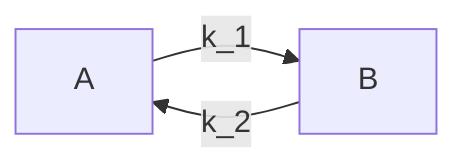

# Infection model: constant force of infection
This example demonstrates infections in a stratified population where the force of infection varies by person "group". This is meant to model people that are split by some defining characteristic -- let us conceptualize that as the provinces of Canada. The initial force of infection varies by province. In line with the , there is no person-to-person transmission, but the force of infection varies with the current prevalence, as if sick people are bringing with them their evil lettuce. People may move between provinces, which also impacts the force of infection.

This model differs from the last example in three key ways:
1) The people are divided among regions, and the initial force of infection varies by region.
2) The force of infection changes over time based on the number of infected people.
3) People may move to a different region throughout the simulation, which impacts their risk of sickness and the risk posed to other people in that region.

## Simulation overview

Each region has their own initial force of infection. Based on that force of infection, infection attempts are scheduled in each region, starting at time 0. Infection attempts are scheduled to occur at an exponentially distributed time based on the force of infection scaled by the number of people who are currently sick in the region. The simulation ends after there are no more infection events.

```mermaid
graph TD
evil lettuce--foi(n infected)-->infected;
evil lettuce--next attempt at t + exp(1 / (foi * n infected))-->evil lettuce
infected--t + exp(1 / inf. period)-->recovered;
```

Infected individuals recover at a time `t + infected period` where the infected period is an exponentially-distributed random variable based on the recovery rate. Upon recovery, infected individuals stay as recovered for the rest of the simulation. They can still move between regions.

Simultaneously, movement between regions is scheduled at a given rate, starting at time 0, so that people can move across regions. The movement rate between regions does not need to be congruent -- so movement from `A` to `B` does not necessarily equal movement from `B` to `A`. (People may want to go from `A` to `B` more readily than people go from `B` to `A`) At each movement time, a random person -- regardless of their infection status -- is selected to move. Their recovery time and infection status does not change.



To determine the next movement time, there needs to be a bit of math: this a system of equations of two times the number of regions, and each region pair has a different movement rate. The Gillespie method is used to efficiently determine the between which pair of regions movement occurs and when it occurs.

However, because movement happens independently of infection, the force of infection may change when a new person is added to the region, even if that does not coincide with a new infection being scheduled, which is when the next automated querying of the number of infectious people occurs. Instead, the addition of a new person to the region will cause a check to see if the force of infection changes and update the next plan accordingly.

```mermaid
flowchart LR
movement--new person introduction-->transmission-->checks if infection plan needs to be changed
```

Note that this example considers regions where each individual must be part of one and only one region. Regions can also have a hierarchy, so that the region `A` fits into a larger region of, say, North America. However, we view regions as a special case of the generic "group" where there are some stratifying characteristics, and people can fit into zero, one, or many of the classes of a group (like an individual being part of the group of people that visit the supermarket, the library, and/or the DMV).

The global model parameters are as follows:
* `population_size`: number of individuals by group (in this example, we assume that each region has the same number of people to start)
* `k`: number of stratified population groups/regions
* `foi`: initial force of infection in eah stratified group, vector of size `k`
* `infection_period`: time that an individual spends from infection to recovery
* `movement`: pair-wise movement rates, square matrix of length `k`

## Architecture
As in other `ixa` models, the simulation is managed by a central `Context` object which loads parameters, initializes user-defined modules, and starts a callback execution loop:

```rust
struct Parameters {
    random_seed: u64,
    population_size: usize,
    k: usize,
    foi: Vec<f64>,
    infection_period: u64,
    movement: Vec<Vec<f64>>
}

let context = Context::new();
context::load_parameters<Parameters>("config.toml")

// Initialize modules
mod people
mod transmission
mod infection
mod movement

people.init();
transmission.init();
infection.init();
movement.init();

// Run the simulation
context::execute();
```

Individuals transition through a typical SIR pattern where they start off as susceptible (S), are randomly selected to become infected (I), and eventually recover (R).


The basic structure of the model is as follows:

* A `Population Loader`, which initializes a population in `k` regions, attachs an infection status property to each individual, and places each individual in a region.
* A `Transmission Manager`, which determines the number of infectious people in the region, calculates the force of infection in that region accordingly, schedules infectious attempts based on that force of infection where it picks an individual in the region, updates the infectious status of that person if successful, and schedules the next attempt.
* An `Infection Manager`, which listens for infections and schedules recoveries.
* A `Report Writer` module, which listens for infections and recoveries and writes output to csv files, containing region-stratified disease patterns.

Note that this will require some kind of parameter loading utility from `ixa` which reads from a config file / command line arguments, and exposes values to modules as global properties.

### People and person properties
When the `Population Loader` module initializes, a number of persons are created and given a unique person id (from `0` to `population_size`). This functionality is provided by an `add_person` method from `ixa`, which adds them to a `People` data container.

In order to record the infection status of a person, we use another `ixa` utility for defining "person properties". Internally, this associates each person in the `People` data container with an enum value and and provides an API for modules to read it, change it, or subscribe to events when the property is changed somewhere else in the system.

We must also assign people to a region.

```
infection_status = enum(
    Susceptible,
    Infected,
    Recovered
);

for (person_id in 0..parameters.get_parameter(population_size)) {
    context.create_person(person_id = person_id)
}

context.define_person_property(
    infection_status,
    default = Susceptible
);
```

When initialized, each person is assigned an default state (`Susceptible`).

Once the population has been created, all modules have been initialized, and event listeners have been registered (more on this below), the simulation is ready to begin the execution loop.

### Scheduling infections and recoveries
In this model, the `Transmission Manager` module begins the simulation by adding a infection attempt `plan`, which is just a callback scheduled to execute at `current_time = 0`. The callback randomly selects a person and transitions them to infected if they are susceptible; if they are not susceptible, it will skip over them. Finally, a new infection attempt is scheduled for a time drawn from an exponential distribution with mean value of `1/infection_rate`.

```
fn attempt_infection(context) {
    transmission_rng = rng.get_rng(id = transmission);
    population = context.get_population();
    person_to_infect = transmission_rng.sample_int(from = 0, to = population);

    if (context.get_infection_status(person_to_infect) == Susceptible) {
        context.set_infection_status(person_to_infect, Infected);
    }

    foi = parameters.get_parameter(foi);
    time_next_infection = transmission_rng.draw_exponential(1/foi);
    context.add_plan(attempt_infection(context), time = context.get_time() + time_next_infection);
}

//initialization
init(context) {
    context.add_rng(id = transmission);
    context.add_plan(attempt_infection(context), time = 0);
}
```

Note that this makes use of the following `ixa` functionality:

* The getters/setters provided by `person_properties`, as described in the previous
  section
* An `add_plan` method to register infection attempt callbacks
* A `random` module to sample the population and generate the next infection time

Updating the `infection_status` of a person should broadcast a mutation
event through the system, which might be structured something like the following:


For any person property that is registered, `ixa` stores a list of callbacks
registered by other modules. When a mutation is made to that person property,
the event manager releases an event with relevant related data
(the id of the person, the old and/or new property) to all matching registered
callbacks.

In this model, when the `disease_status` is updated to `Infected`, a handler
registered by the `Infection Manager` will be triggered, which is responsible
for scheduling recovery plans:

```
fn handler(context, person_id, previous_infection_status) {
    if (context.get_infection_status(person_id) == Infected) {
        infection_rng = context.get_rng(id = infection);
        infection_period = parameters.get_parameter(infection_period)
        recovery_time = infection_rng.draw_exponential(1/infection_period);
    context.add_plan(context.set_infection_status(person_id, Recovered), time = recovery_time);
    }
}

//initialization
init(context) {
    context.add_rng(id = infection);
    context.observe_person_property_event::<DiseaseStatus>(handler);
}
```

Recovery of an infected individuals are scheduled for a time `t + infection_period`
where `infection_period` comes from an exponential distribution. This is provided
by an `rng` instance independent from the one in the `Transmission Manager`.

### Reports

This model includes two types of reports focused on tracking the state of the
infection status:

1. Instantaneous report on changes in person properties, and
2. The current state of person properties reported periodically.

#### Instantaneous Reports
For this report, we want to record a timestamp when a person is infected
and when they recover. The output of the report will look something like this:

```
person_id,infection_status,t
0,Infected,0
1,Infected,1.2
0,Recovered,7.2
1,Infected,8.5
...
```
At initialization, a `Report` module registers a type for `Incidence`
and subscribes change events on the `infection_status` of a person

```rust
struct IncidenceReport {
    person_id: u64,
    infection_status: InfectionStatus,
    t: u64
}

fn init(context) {
    context.add_report::<IncidenceReport>("incidence");
    context.observe_person_property_event::<InfectionStatus>(handle_infection_status_change);
}
```

The method `handle_infection_status_change` writes a new line to the report file, recording the status and the current time:

```rust
fn handle_infection_status_change(context, person_id, prev, current) {
    context.add_report(Incidence(
        person_id,
        infection_status: current,
        t: context.get_current_time()
    ));
}
```

One consideration here is that if the callback references context, it should
provide the state of the context exactly at the time the event was released.

#### Periodic Reports
The second type of report records something about the current state of the
simulation at the end of a period, such as after every day.

For this example, we record a count of the number of individuals with each
infection status (S,I,R) at the end of every day:

```
day,infection_status,count
0,Suceptible,92
0,Infected,8
0,Recovered,0
1,Suceptible,89,
1,Infected,12
1,Recovered,0
...
```

In this case, we could actually compute each daily summary in
post-processing from the instantaneous reports instead of generating a second
set of periodic reports. However, we want a summary of properties
which are not otherwise recorded, such as perhaps whether an individual is
hospitalized.

To efficiently keep track of the current state of each infection status,
we will create an additional data structure to keep a count of individuals in
each state and is updated every time a change event is released.

```rust
// Internally, HashMap<InfectionStatus, usize>
let counter = PersonPropertyCounter<InfectionStatus>::new();
context.add_data_container(counter);
```

On initialization, the Report manager computes an initial count for each status.
In `update_property_counter` the event handler, the counter increments/decrements
the appropriate status. It also registers a hook that execute after all plans
for a time t have executed, i.e., `on_period_end`

```rust
fn init(context){
    // Calculate the initial state
    population = parameters::get_parameter(population);
    for i in 0..population {
        counter::increment(
            counter.get_person_property_value(i)
        );
    }
    context::observe_person_property_event(update_property_counter);
    context::on_period_end(0, report_periodic_item);
}
```
Methods are implemented for person property counter to increment and decrement
the counters. Changes in the person properties are
observed and the callback function `update_property_counter` updates the
counts for each property:

```rust
fn handle_infection_status_change(context, person_id, prev, current) {
    counter::increment(current);
    counter::decrement(prev);
}
```

When all plans have executed for a given time t, `ixa` calls the on_period_end
callback to write the report row and schedule the next periodic report:

```rust
fn report_periodic_item(t, context) {
    // Add a row for each status
    for infection_status in counter::iter() {
        context.add_report(Period(
            t,
            infection_status,
            count: counter::get_count(infection_status)
        ));
    }

    // Schedule next report
    next_report_time = context::get_time() + parameters::get_parameter(reporting_period);
    if next_report_time < parameters::get_parameter(max_time) {
        context::on_period_end(report_periodic_item, report_periodic_item);
    }
}
```

## Ixa dependencies

The following are a summary of assumed dependencies from `ixa`:

* `parameters` component: Loads parameters from a file or command line args,
   loads them into global properties (below)
* `global_properties` component: Defines properties which can be accessible
   to any module
* `person` component: Creates a `People` data container which unique ID for each person,
   provides an `add_person()` method
* `person_properties` component: connects each person ID defined by the `person`
   component with a specific property (e.g., `infection_status`), provides add/change/subscribe API
* `reports` component: Handles file writing, provides api for writing typed rows
* `random_number_generator` component: Provides seedable rng api to sample over
   a distribution, list of person ids
* `event_manager` component: provides a global send/subscribe interface
