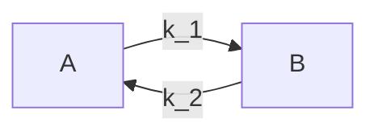
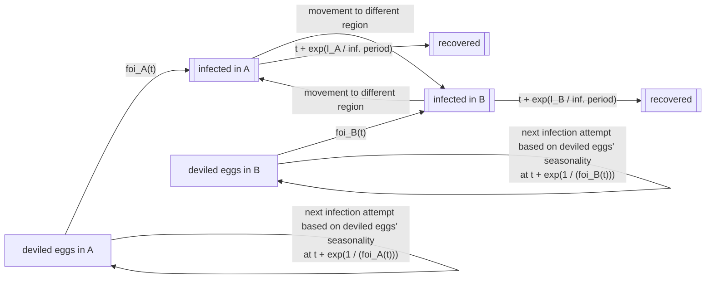

# Infection model: constant force of infection
This example demonstrates infections in a stratified population where the force of infection varies by person "group". This is meant to model people that are split by some defining characteristic -- let us conceptualize that as regions A and B. In line with the , there is no person-to-person transmission. However, in addition to varying by region, the force of infection also varies by season, as if in region A (say, North America), people are more likely to eat deviled eggs from December to January (winter) whereas in region B (South America), they are more likely to eat deviled eggs from June to July (their winter). People may move between regions, which impacts their experienced force of infection. Although moving regions does not impact an individual's infection status immediately, to make this example of regions really need to function like a group and not just a fancy person property, I introduce that an individual's _recovery_ rate scales inversely with the number of infected people currently in the region, as if having more sick people in a region means that an individual cannot as easily obtain the care they require/must wait longer to be cured of their deviled egg syndrome.

This model differs from the last example in three key ways:
1) The people are divided among regions, and the force of infection varies by region.
2) The force of infection changes over time based on seasonality.
3) People may move to a different region throughout the simulation, which impacts their risk of sickness and the duration of recovery posed to other people in that region.

This example introduces the idea of a `group`, which is an abstract concept that enables assigning people to broader categories. I argue that regions are a type of group, a special case that must satisfy some additional constraints beyond the the generic `group`. This detailing of `groups` and how regions is a special case of a group is described more extensively in .

## Simulation overview

This simulation consists of three key pieces of logic:
1) scheduling infection attempts based on a region-specific and time-varying force of infection.
2) scheduling people to move between regions at specified rates.
3) scheduling individual person recovery/progress through the infection course based on the number of sick people in the region.

Each of these pieces of logic is different from the last example -- in fact, #1 and #2 are completely new -- and introduce some new required `ixa` functionality. In particular, a region-specific force of infection requires needing to (a) assign people to regions (enforcing that people are part of one and only one region) and (b) querying a person's region to determine their force of infection. The additional complexity of wanting to make recovery rates dependent on the number of people who are infected in the particular region requires (c) returning all people in person's region.

Secondly, implementing time-varying infectiousness in a continuous time simulator is not trivial. This example explains how to do so using rejection sampling, though there does exist another option, and explains the pitfalls of rejection sampling. Modeling time-varying infectiousness does not require any new functionality from `ixa`.

Finally, this model introduces movement between groups, but that does not actually require any "new" functionality from `ixa` (besides what has been described above in terms of needing to assign people to groups). This is just code that schedules people to have their region changed (or re-assigned) at times based off the specified movement rates.

The simulation ends after there are no more infection events. However, there will be still schedules of people moving between regions, events which are ignored when determining when to call `context.halt()`.

Movement between regions is scheduled at a given rate, starting at time 0, so that people can move across regions. The movement rate between regions does not need to be congruent -- so movement from `A` to `B` does not necessarily equal movement from `B` to `A`. (People may want to go from `A` to `B` more readily than people go from `B` to `A`). At each movement time, a random person -- regardless of their infection status -- is selected to move. Their infection status does not change, though their recovery time is impacted by their region's number of infected people.



The global model parameters are as follows:
* `population_size`: number of individuals by group (in this example, we assume that each region has the same number of people to start)
* `k`: number of population groups/regions
* `foi_sin_shift`: for ease in this example, imagine that the force of infection is sin(foi_sin_shift * t) + 1; this parameter specifies that phase shift for each region, so is a vector of length `k`
* `infection_period`: base time that an individual spends from infection to recovery, gets scaled by number of infecteds in region
* `movement`: pair-wise movement rates, square matrix of length `k` coded as a vector of lenfth `k` where each element is a vector of length `k`

## Architecture

The basic structure of the model is as follows:

* A `Population Loader`, which places `population_size` people each into the simulation.
* A `Transmission Manager`, which schedules the time for the next infectious attempt. Because the force of infection is not constant, it is slightly more complicated to schedule infectious attempts that are consistent with this changing force of infection. In this particular example, we employ rejection sampling as a way to sample time-varying infectiousness.
* An `Infection Manager`, which watches for infections, people entering or exiting the region, and schedules recoveries  accordingly (based on the number of infected people in the region).
* A `Region Manager`, which assigns people to regions (so there are `population_size` people in each of the `k` regions) and then moves people across regions based on specified rates.
* A `Report Writer` module, which listens for infections and recoveries and writes output to csv files, containing region-stratified disease patterns.

Note that reading this data will require some kind of parameter loading utility from `ixa` which reads from a config file / command line arguments, and exposes values to modules as global properties.

As in other `ixa` models, the simulation is managed by a central `Context` object which loads parameters, initializes user-defined modules, and starts a callback execution loop:

```rust
struct Parameters {
    random_seed: u64,
    population_size: usize,
    k: usize,
    foi: Vec<f64>,
    infection_period: u64,
    movement: Vec<Vec<f64>>
}

let context = Context::new();
context::load_parameters<Parameters>("config.toml")

// Initialize modules
mod people
mod transmission
mod infection
mod regions

people.init();
transmission.init();
infection.init();
regions.init();

// Run the simulation
context.execute();
```

Individuals transition through a typical SIR pattern where they start off as susceptible (S), become randomly infected (I), and eventually recover (R). However, this example is different from the preceding where (a) individuals become infected at a _time-varying_ force of infectiousness that depends on their region $r$, $foi_r(t)$. Then, individuals recover at a rate that scales inversely with the number of infected people in the region, so the recovery rate, $\gamma \propto 1 / I_r$.



### People and person properties

### Movement between regions

### Scheduling infection based on time-varying foi

### Scheduling recoveries based on number of infected people in region

## Reports

## Ixa dependencies

The following are a summary of assumed dependencies from `ixa`:

* `parameters` component: Loads parameters from a file or command line args into global properties, accessible by any module.
* `global_properties` component: Defines properties which can be accessible to any module.
* `person` component: Creates a `People` data container with unique ID for each person, provides an `add_person()` method that enables information about the person -- from other modules -- to be attached to the person.
* `person_properties` component: connects each person ID defined by the `person` component with a specific property (e.g., `infection_status`), provides an API to change properties and subscribe to changes in those properties.
* `groups` component: defines groups, their group properties including membership rules, and an API for assigning people to groups in line with the group membership rules, getting people in the group and the groups for a given person, and subscribing to changes in people's groups.
* `reports` component: Handles file writing, provides API for writing typed rows.
* `random_number_generator` component: Provides seedable rng API to sample over a distribution or list of person ids.
* `event_manager` component: provides a global send/subscribe interface.
