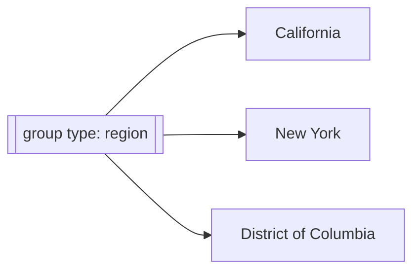
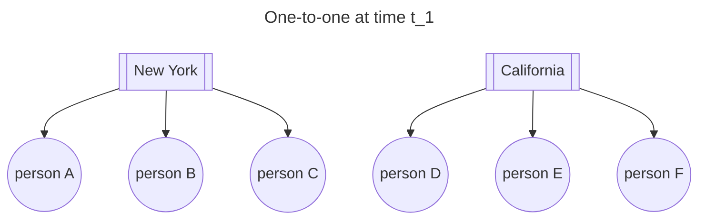
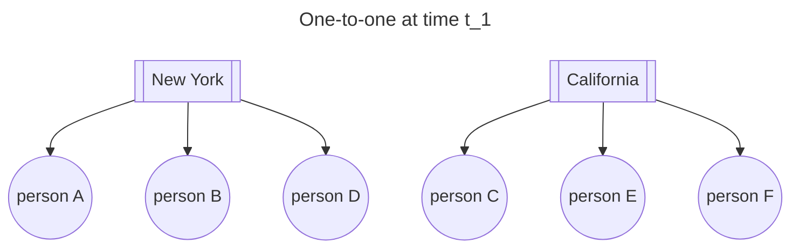
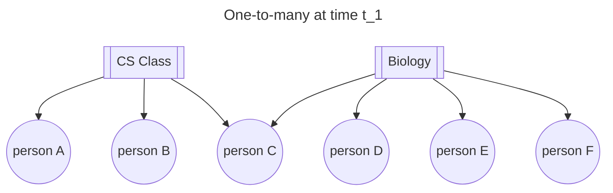
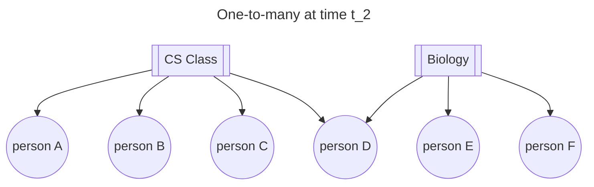
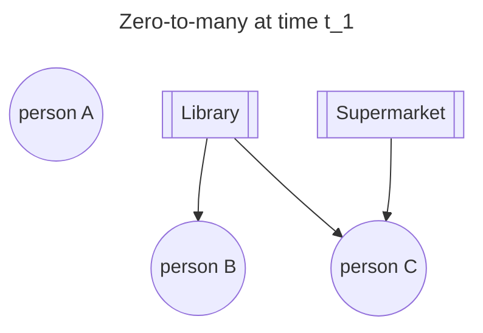
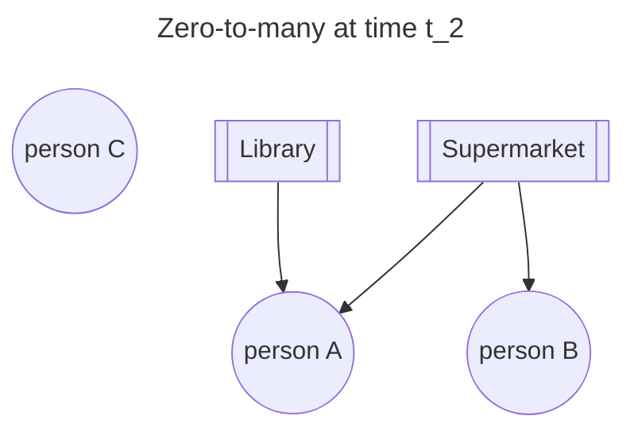
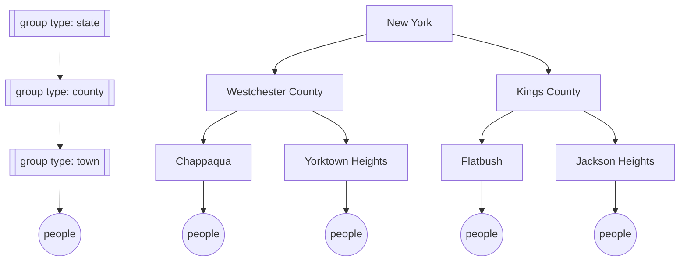

## Overview

This example defines the `ixa` `group` component. Groups are different from person properties, though both result in people being associated with some characteristic. This document explains the characteristics of groups and the `groups` API that `ixa` exposes to users.

One key goal of this document is to define `groups` in a generic enough way that it encompasses the traditional notion of `regions` as was defined in GCM (more on this below, and how regions were previously different from groups). I hold the belief that exposing to the user two different functionalities that feel so similar is (a) confusing for determining when to use which one, (b) confining because there may be types of groups that do not satisfy all the requirements of a region but would benefit from having some of the capabilities that were included in the previous `regions` plugin, and (c) hurts code modularity and expandability in case a user would like to switch from using groups to regions as they better understand that their use case fits the requirements of one more than the other. I also believe that `groups`, `regions`, and `partitions` "feel" very similar, and further expanding the idea of `groups` presented here to include `partitions` -- even if there is still an internal `partitions` component but it is folded into `groups` when exposed to the user -- would be useful for later development. Concretely, I conceputalize this as the user being able to create a special type of group that is implicitly defined by a matching set of person properties and membership in other groups, and then being able to return the people in that group at a given time when asked.

## Definition

Let us describe the use cases for a group and define a group so that it's difference from person properties is clear. A group is a collection of people. For it to be meaningful to define a collection of people, they must all have some shared attribute, but that shared attribute does not necessarily need to be defined as a person property. This paradigm differs from person properties in two key ways, and this helps explain the API that `groups` must expose to `ixa` users:

1) It should be straightforward to get all people in a group.
2) People can be part of multiple groups -- given that the group membership rules are properly specified (more on this below) -- and it should be straightforward to get all the groups of which a person is part.

In addition, groups have two extra capabilities.
1) Groups may fit into parent groups, so there is a hierarchy of groups. For instance, towns are part of counties, and counties are part of states.
2) Groups can have other information (for instances, available resources) attached to them (though this is really just an external hash map of (group, resource) pairs that a user could specify).

## Use Cases

From a modeling perspective, groups enable an abstraction beyond explicitly needing to model each individual's interactions. They enable approximating an individual's specific interactions with an interaction from a random person in a relevant group. Here I detail how these groups may be used in practice.

1) Imagine people who visit the library, the supermarket, and/or the DMV after the work day is over. Rather than modeling the interactions an individual may have in each of these settings explicitly, place them in the library group, the supermarket group, and the DMV group. When selecting infectious contacts for a person, pick a random person in the group and attempt infection.
    - This is an example of a group type where the person can be in zero (say the person does not visit anywhere after work is over) to many of these different types of "community" groups. Each of these groups may fit into a broader type of group of, say, "government" settings (library, DMV) or "private" settings (supermarket) that impacts the type of interactions they may have (consider that mask wearing is required in private settings).

2) Imagine children who are part of a school. Children are always part of at least one classroom, but they may be part of multiple classrooms (i.e., certain children from certain classrooms combine to all go to CS class together). Instead of explicitly modeling the interactions of each child in each set of classrooms, children are assigned to at least one classroom group.
    - This is an example of a group type where the person is in at least one group and may be in many. There is also the option for hierarchy in the groups: multiple classrooms make up a school, and schools are part of districts.
    - This example helps illustrate the importance of attaching resources to a group: let us say that schools have masks available for students, but there are different numbers of masks available (perhaps even based on the resources available to the district!). Having access to the number of masks available enables modeling mask distribution, which can impact transmission.

3) Imagine a population of people in a city, half of whom live in shelters and have of whom live in the broader population. There are different shelters, but they all fit into the broader hierarchy of "shelters". People can only ever be part of either a shelter or the broader population. People may move between groups, and infectious contacts happen only between people in the same group -- so there is a need to grab the other people in an infectious person's group when attempting infection.
    - This is an example of a group type where people must be part of one the groups and only ever one. This is akin to "regions" in the traditional GCM context.

## Properties

The use cases motivate key properties of `groups`:

- A unique group identifier, such as `Region`, `Classroom`, `CommunityPlace`. These identifiers are the _type_ of group, not the groups themselves. So, the `Region` group type may have groups `California`, `New York`, `DC`, etc.



- A membership rule that describes the type of membership people can have across groups in a group type: a person must be in and only one group, a person must be in one group but can be in more, a person can be in zero to many groups.



A person can only change groups when the mapping is one-to-one:





A person can add or change groups when the mapping is one-to-many:





A person can add, remove, or change groups when the mapping is zero-to-many:



Note that in all cases it is possible to have empty groups; it is just that people may have rules about being required to fit into a group.

- Groups can have parent groups and fit into a broader group hierarchy that describes relationships between groups.



- Groups can have information attached to them, like the available resources. All groups within a particular group type must have the same

Model authors should be able to do the following with people and groups. Below each function, I describe a _**potential**_ API for how `ixa` could expose the required functionality to users. This is very subject to change as we further define the notion of `people`, `person_properties`, and then `groups`.

* Define a group type, its constituent groups (which must all be defined at the beginning of the simulation), and the group's membership mapping (required).

```rust
use ixa::GroupMappings
enum GroupTypes {counties, states}
enum Counties {A, B}
define_group!(group_type = GroupTypes::regions, // could also call this `group_id`
              groups = Counties,
              membership_mapping = GroupMappings::one_to_one)
```

* Define potential parent-child relationships between groups -- groups can only ever have one direct parent. A group's parent can be reassigned in the middle of the simulation.

```rust
enum States {X, Y}
context.make_group_hierarchy(child = (Counties::A), // a tuple so you could define multiple children for the same parent at once
                             parent = States::X)
```

* Assign people to a group at the time of person building. Note this pseudocode is subject to change based on how we conceptualize people addition as development continues.

```rust
mod population_loader
context.add_person() --> PersonCreationEvent
person.finalize()

mod regions
context.subscribe_to_event(PersonCreationEvent, handle_new_person)

fn handle_new_person(context: &mut Context, person_creation_event: PersonCreationEvent) {
    context.assign_person_to_group(person_creation_event.person_id(),
                                   Counties::A) // takes a tuple so can easily add the person to multiple groups in one command
}
```

* Change someone's group membership, which includes adding them to or removing them from groups.
    * These changes must be in line with the membership rules, but `ixa` checks that the membership rules are satisfied. To be clear, I conceptualize this as `ixa` providing `assign_person_to_group` and `remove_person_from_group` trait extensions on `context`, and calling `assign_person_to_group` may actually contain more logic than just assigning a person to a group based on the group type's membership rules. Concretely:
        * If the group type has a one-to-one membership rule, assigning someone to a group after their initial assignment is the same as removing them from their existing group and adding them to the new group. Explicitly trying to remove people from their one group causes `ixa` to `panic!`.
        * If the group type has one-to-many membership, people can be arbitrarily added to any given group, so `assign_person_to_group` makes an additional group assignment. Again, explicitly trying to remove remove a person from a group causes `panic!` if they are only part of that one group at the time at which removal is called.
        * If the group type has zero-to-many membership, people can be arbitrarily added or removed from any groups.

```rust
// person is no longer part of Counties::A and only part of Counties::B
context.assign_person_to_group(person_id, Counties::B)
// group membership mapping of `Counties` is one-to-one
context.remove_person_from_group(person_id, Counties::B) --> panic!
```

* Given a group, get all the people who are part of that group at the time at which the function is called.

```rust
context.get_group_members(Counties::A) --> Vec<person_id>
```

* Given a group type, list its constituent groups.

```rust
context.get_groups_from_grouptype(GroupType::states) --> Vec<Any>
```

* Given a group, get its parent group (and their parents up until the top of the tree?).

```rust
context.get_group_parent(Counties::A) --> Tree<Any>
```

* Given a group, list all of its child groups (and their children up until the bottom of the tree?).

```rust
context.get_group_children(States::X) --> Tree<Any>
```

* Given a person, list the groups of which they are part, split by group type.

```rust
context.get_group_membership(person_id) --> HashMap<GroupType, Any>
```

* Attach other information to a group, and be able to change that information throughout the simulation (like available resources).

```rust
define_group_information!(Counties,
                          AvailableMasks,
                          Option<i64>,
                          default = None)

context.attach_group_information(Counties::A,
                                 AvailableMasks,
                                 Some(42))
```

## Architecture

There are two possible structures we could consider here; one is a model
where groups are special entities which must be assigned members, the other is
that a group is an association with some set of matching person property values.

### Explicit group members

Each person has an association with a group via assignment:

```rust
enum Regions {
  California,
  NewYork,
  //...
}
define_group!(
  RegionId,
  GroupMappings::one_to_one,
)

person.assign_to_group(RegionId, Regions.California);
```

### Group members as queries of person properties

Groups define a query, which represents a set of matching person property values

```rust
enum Regions {
  California,
  NewYork,
  //...
}
define_group!(
  RegionGroupId,
  GroupMappings::one_to_one,
  RegionId
)

define_person_property!(
  RegionId,
  Regions
)

// This causes the group to update because it matches the query
person.set_person_property(RegionId, Regions.California);
```
